# Storage Architecture Patterns

**Visual Guide to Data Storage Architectures**

## Table of Contents

1. [Medallion Architecture Diagram](#medallion-architecture-diagram)
2. [File Format Decision Tree](#file-format-decision-tree)
3. [Partitioning Strategies](#partitioning-strategies)
4. [S3 Storage Classes](#s3-storage-classes)
5. [Data Flow Patterns](#data-flow-patterns)
6. [Compression Pipeline](#compression-pipeline)
7. [Schema Evolution Workflow](#schema-evolution-workflow)

## Medallion Architecture Diagram

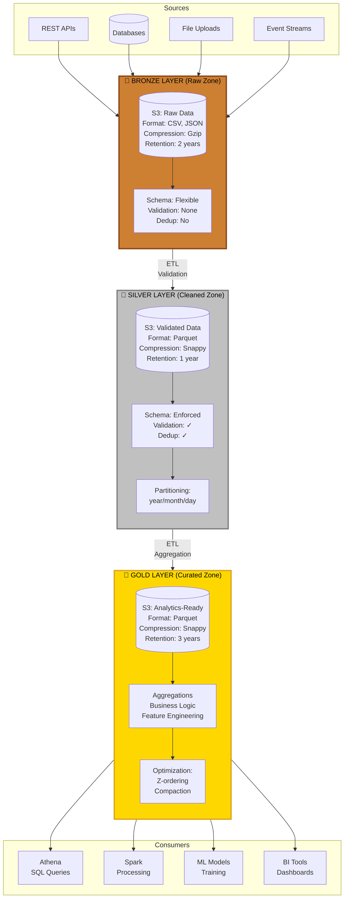

## File Format Decision Tree

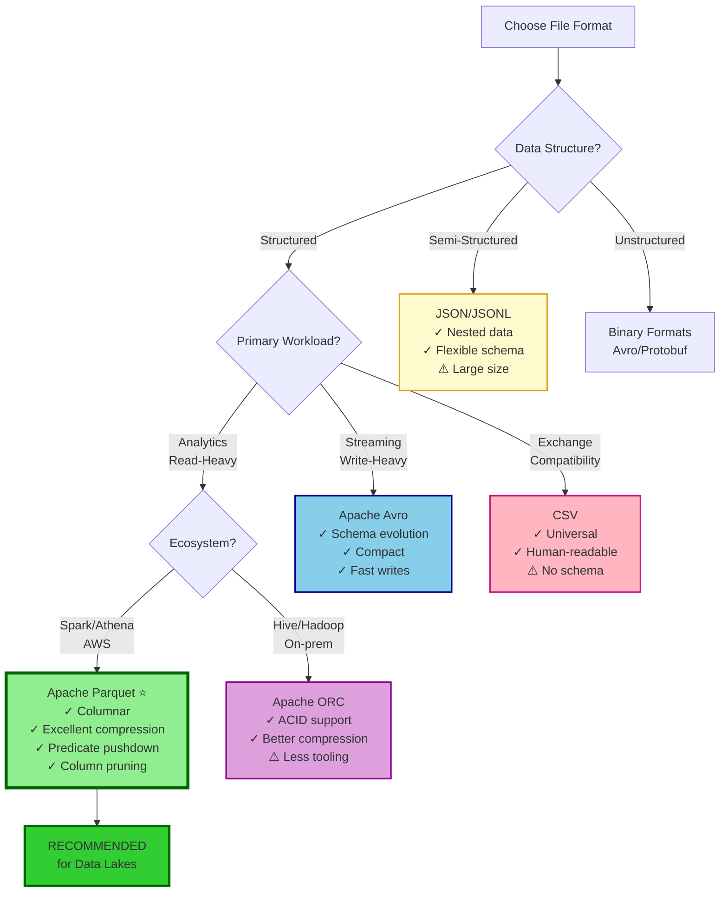

## Partitioning Strategies

### Strategy 1: Time-Based Partitioning

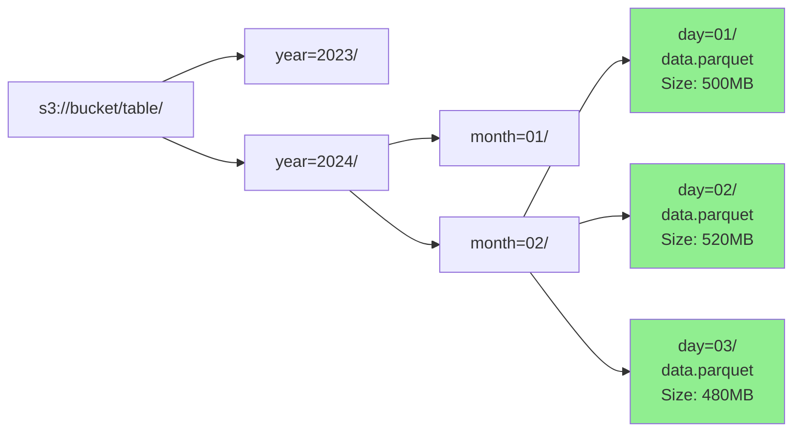

**SQL Query with Partition Pruning:**
```sql
SELECT * FROM transactions
WHERE year = 2024
  AND month = 02
  AND day = 02;

-- Scans only: year=2024/month=02/day=02/
-- Skips: All other partitions (99% of data)
```

### Strategy 2: Multi-Dimensional Partitioning

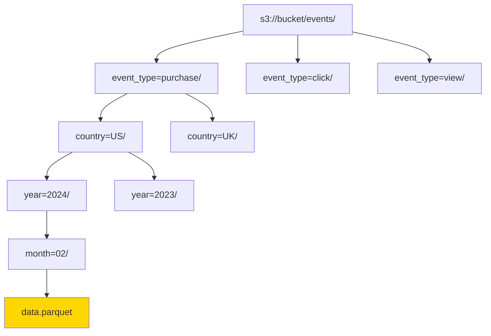

**Benefits:**
- Query by event type: Skip 66% data
- Query by country: Skip 50% data
- Query by date: Skip 98% data
- Query by all three: Skip 99.9% data ✅

### Strategy 3: Hash Partitioning (Avoid Over-Partitioning)

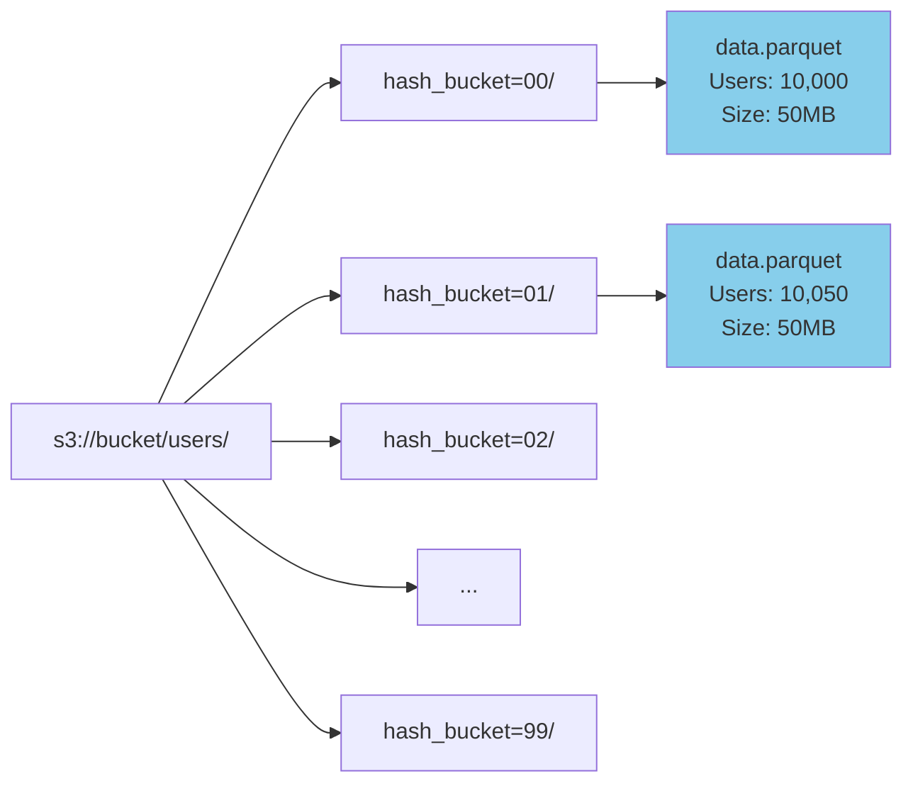

**Use Case:** Millions of high-cardinality values (user_id)
```python
# Generate hash bucket
user_hash = hash(user_id) % 100  # 100 buckets
partition_path = f"hash_bucket={user_hash:02d}/"
```

## S3 Storage Classes

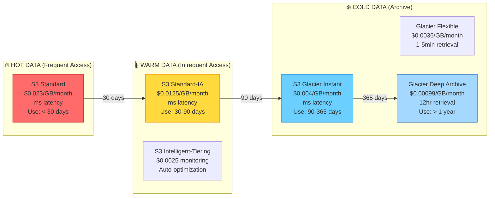

**Lifecycle Policy:**
```python
lifecycle_rules = [
    {
        'Id': 'Bronze-to-Archive',
        'Filter': {'Prefix': 'bronze/'},
        'Status': 'Enabled',
        'Transitions': [
            {'Days': 30, 'StorageClass': 'STANDARD_IA'},
            {'Days': 90, 'StorageClass': 'GLACIER'}
        ]
    },
    {
        'Id': 'Silver-retain-warm',
        'Filter': {'Prefix': 'silver/'},
        'Status': 'Enabled',
        'Transitions': [
            {'Days': 90, 'StorageClass': 'GLACIER'}
        ]
    }
]
```

## Data Flow Patterns

### Pattern 1: Batch ETL pipeline

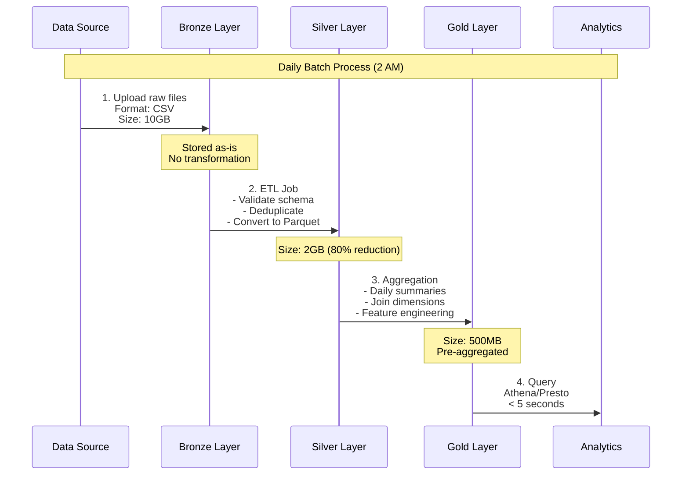

### Pattern 2: Streaming Ingestion

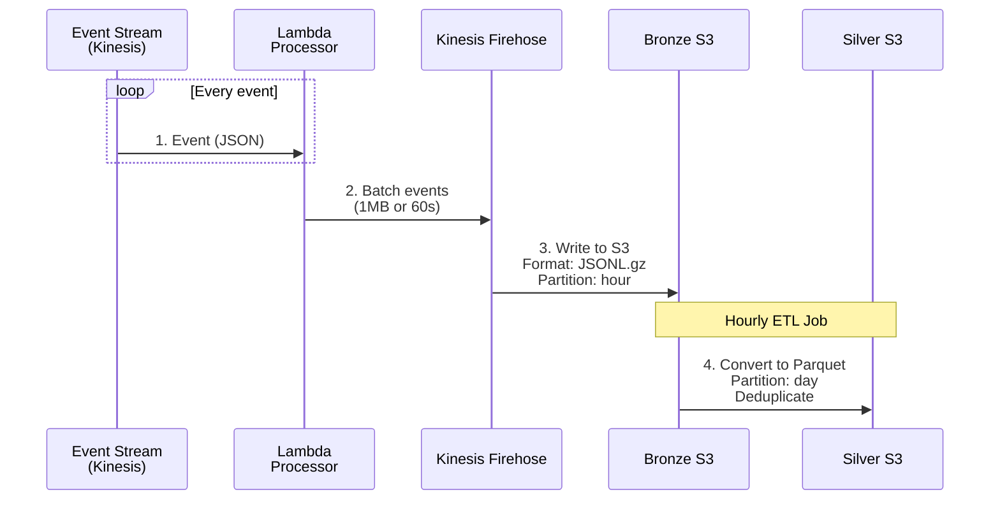

### Pattern 3: Change Data Capture (CDC)

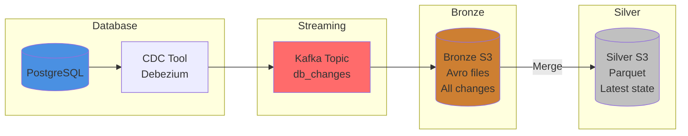

## Compression pipeline

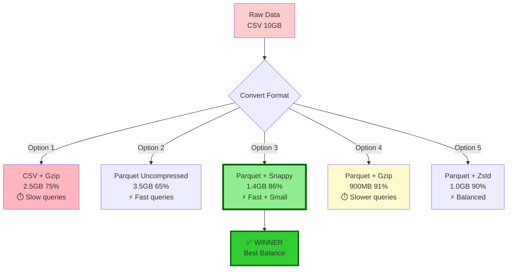

**Benchmark Results:**
| Format | Size | Write Time | Read Time (Scan) | Read Time (Filter) | Cost/Month |
|--------|------|-------------|--------|----------|-----------|
| CSV | 10GB | 2 min | 45 sec | 45 sec | $0.23 |
| CSV + Gzip | 2.5GB | 8 min | 60 sec | 60 sec | $0.06 |
| Parquet | 3.5GB | 5 min | 10 sec | 3 sec | $0.08 |
| **Parquet + Snappy** | **1.4GB** | **6 min** | **8 sec** | **2 sec** | **$0.03** ✅ |
| Parquet + Gzip | 900MB | 15 min | 25 sec | 8 sec | $0.02 |

## Schema Evolution Workflow

```mermaid
stateDiagram-v2
    [*] --> v1: Initial Schema

    state v1 {
        [*] --> Schema_v1
        Schema_v1: id: int
        Schema_v1: name: string
        Schema_v1: amount: float
    }

    v1 --> v2: Add Optional Column<br/>✅ Backward Compatible

    state v2 {
        [*] --> Schema_v2
        Schema_v2: id: int
        Schema_v2: name: string
        Schema_v2: amount: float
        Schema_v2: email: string (optional)
    }

    v2 --> v3: Add with Default<br/>✅ Full Compatible

    state v3 {
        [*] --> Schema_v3
        Schema_v3: id: int
        Schema_v3: name: string
        Schema_v3: amount: float
        Schema_v3: email: string
        Schema_v3: status: string (default="active")
    }

    v3 --> v4_bad: Rename Column<br/>❌ BREAKING CHANGE
    v3 --> v4_good: Add New Column<br/>✅ Safe

    state v4_bad {
        note left of v4_bad
            DON'T DO THIS:
            name → full_name
            Breaks old readers!
        end note
    }

    state v4_good {
        [*] --> Schema_v4
        Schema_v4: id: int
        Schema_v4: name: string
        Schema_v4: full_name: string (computed)
        note right of Schema_v4
            Keep both columns
            during migration
        end note
    }

    v4_good --> [*]
```

### Schema Evolution Rules

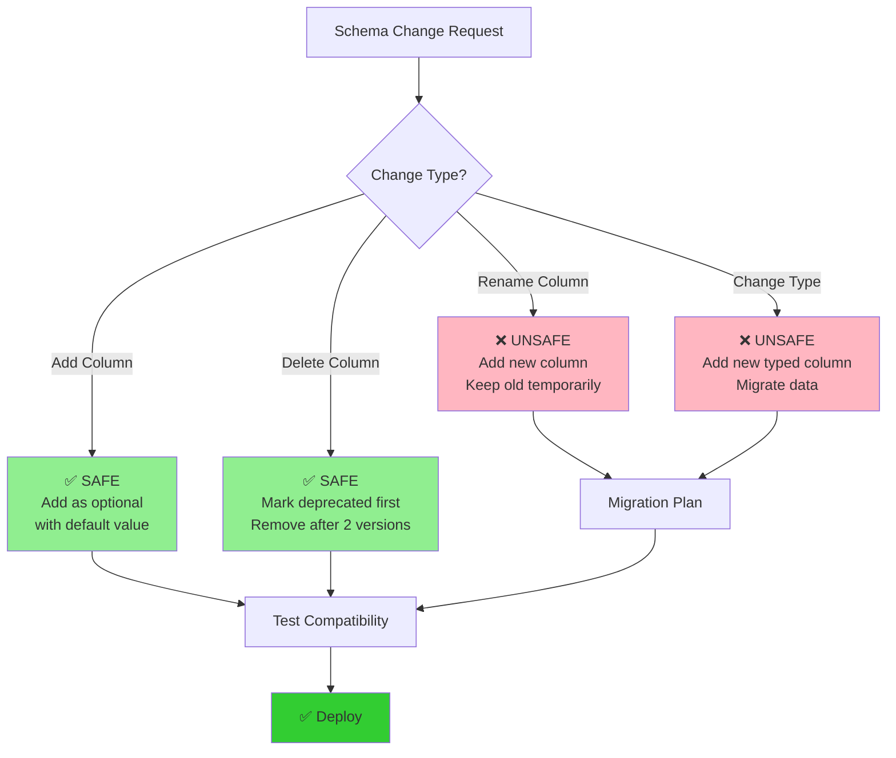

## Partitioning Performance Comparison

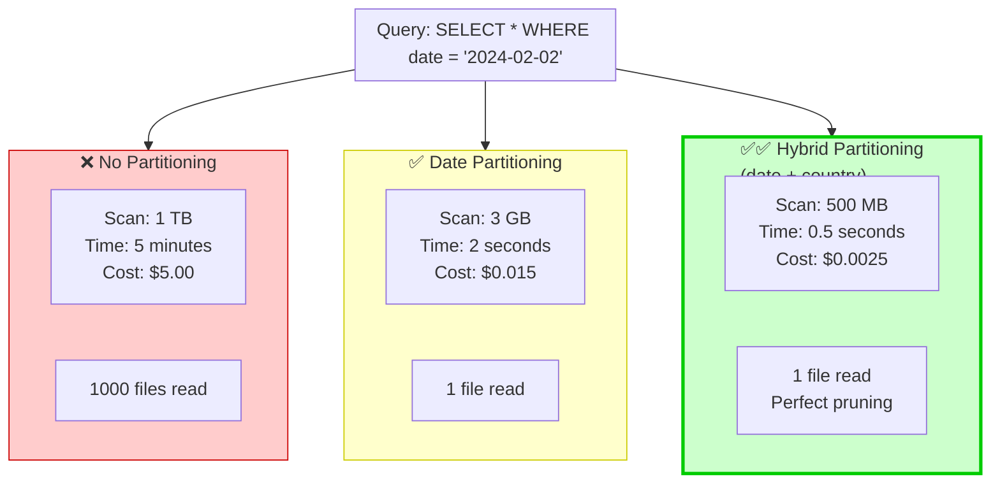

## Data Lake Monitoring Dashboard

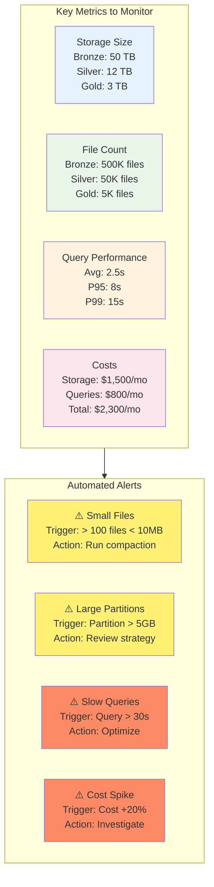

## Architecture Decision Tree

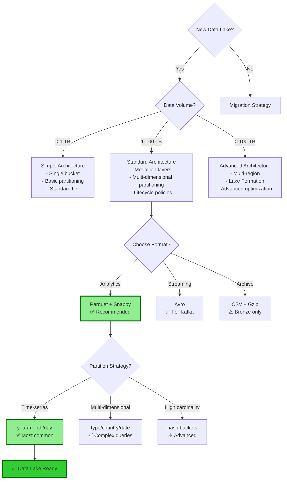

## Summary

### Key Architecture Decisions

1. **Layers:** Use Medallion (Bronze → Silver → Gold) for progressive refinement
2. **Format:** Parquet + Snappy for analytics (primary choice)
3. **Partitioning:** Date-based for time-series, hybrid for complex queries
4. **Compression:** Snappy (balance), Gzip (archive), Zstd (modern)
5. **Storage Classes:** Lifecycle policies to move cold data to cheaper tiers
6. **Monitoring:** Track size, file count, query performance, costs

### Reference Implementation

See exercises for hands-on implementation of these architectures:
- Exercise 01: Medallion data lake design
- Exercise 02: Format conversion pipeline
- Exercise 03: Partitioning strategies
- Exercise 04: Compression benchmarking
- Exercise 05: Schema evolution
- Exercise 06: Glue Catalog integration

---

*These diagrams represent production-grade architectures used by companies processing petabytes of data daily.*
