# 🐼 Pandas Operations - Operaciones Visualizadas

## 📊 Anatomy of a DataFrame

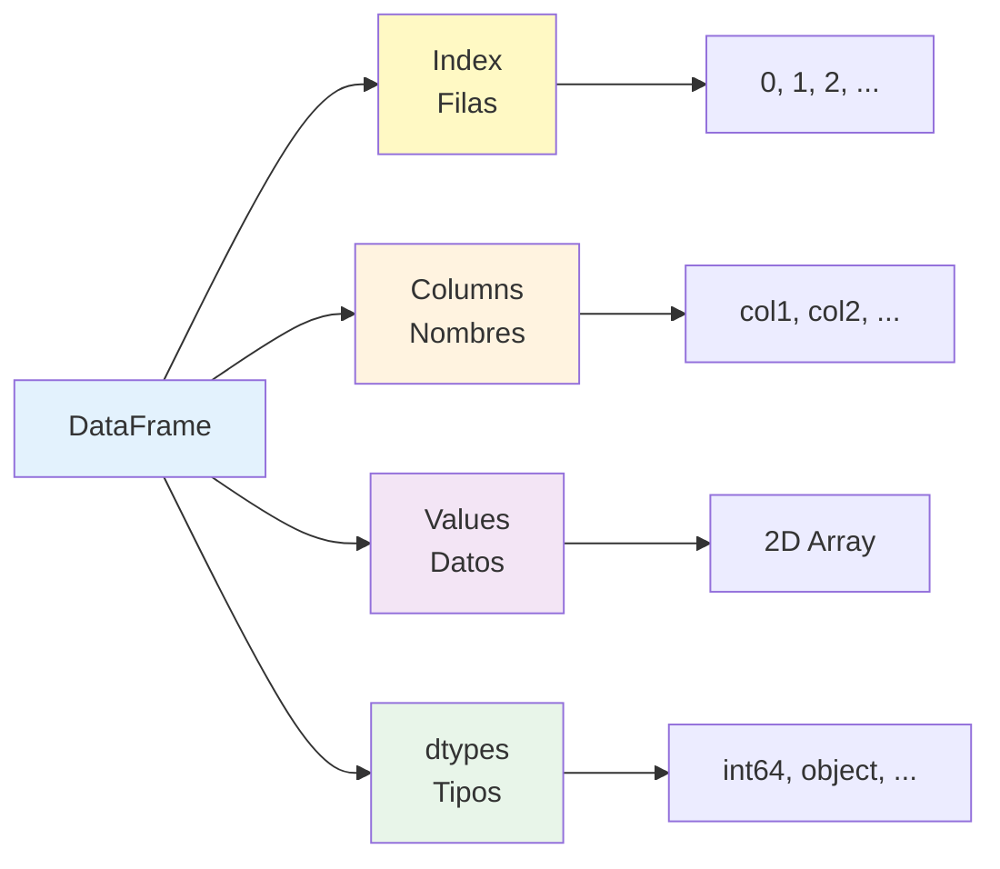

## 🎯 Data Selection

### loc vs iloc

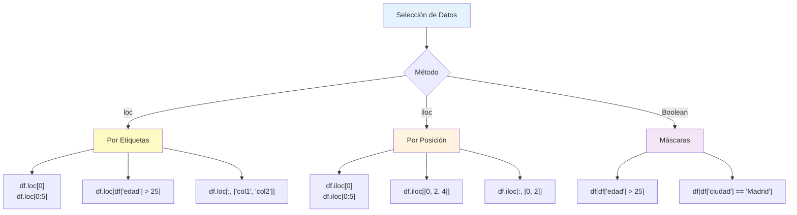

## 🔄 Transformation pipeline

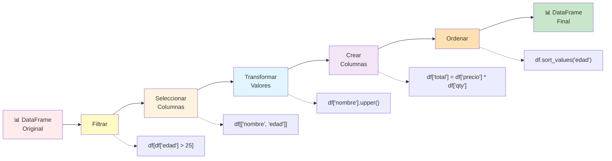

## 🔗 Tipos de Joins

### Inner Join
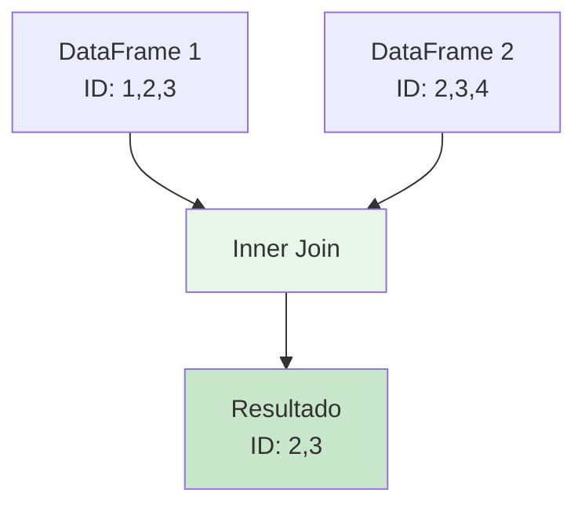

### Left Join
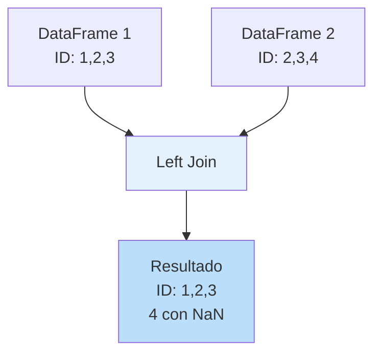

### Right Join
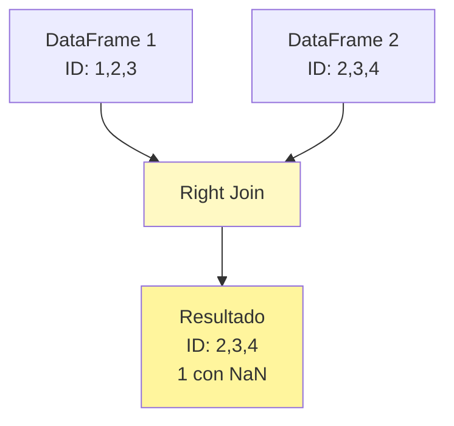

### Outer Join
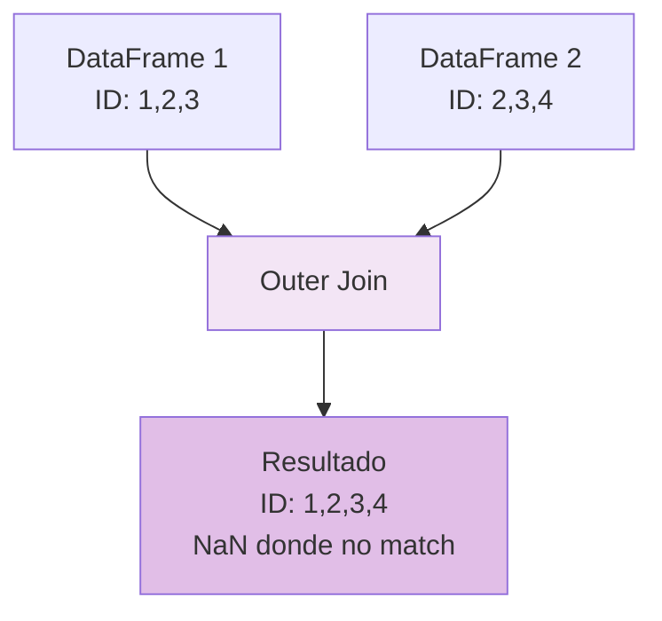

## 📊 GroupBy Operations

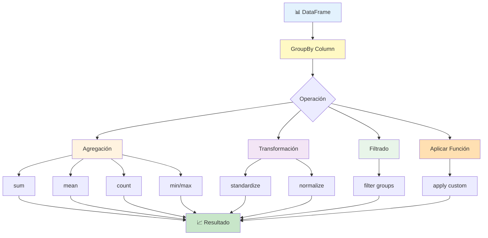

### GroupBy Visual Example

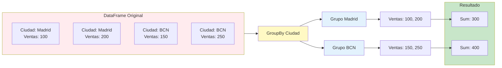

## 🧹 pipeline de Limpieza

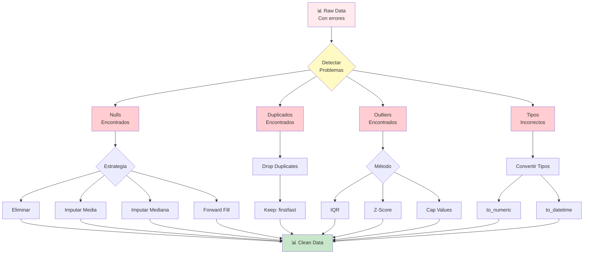

## 📈 Multi-Level Aggregation

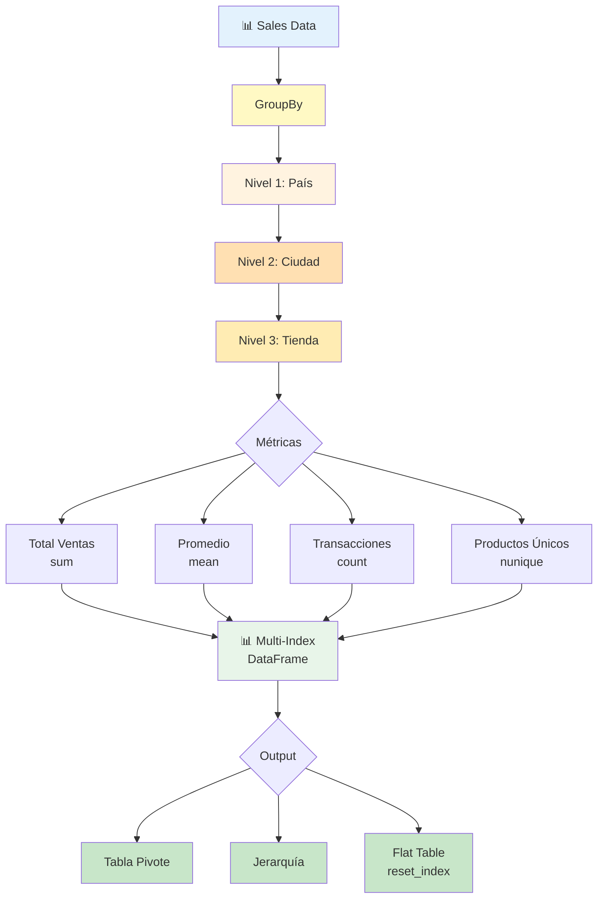

## 🔄 Reshape Operations

### Pivot (Wide Format)
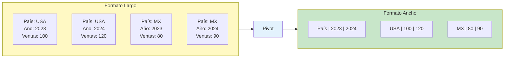

### Melt (Long Format)
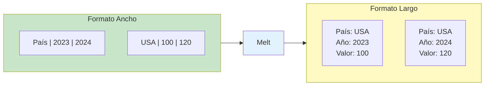

## 📊 Window Functions

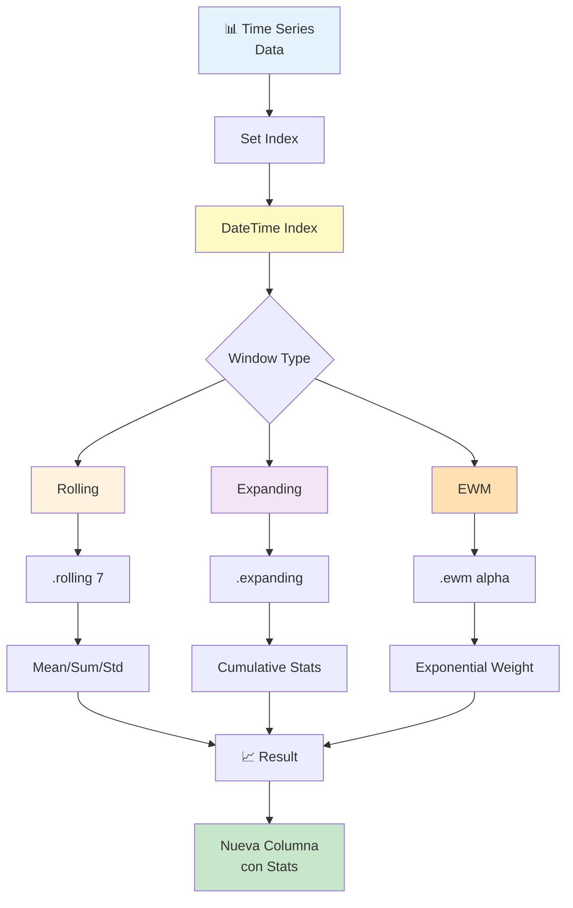

## 🎨 Apply, Map, Applymap

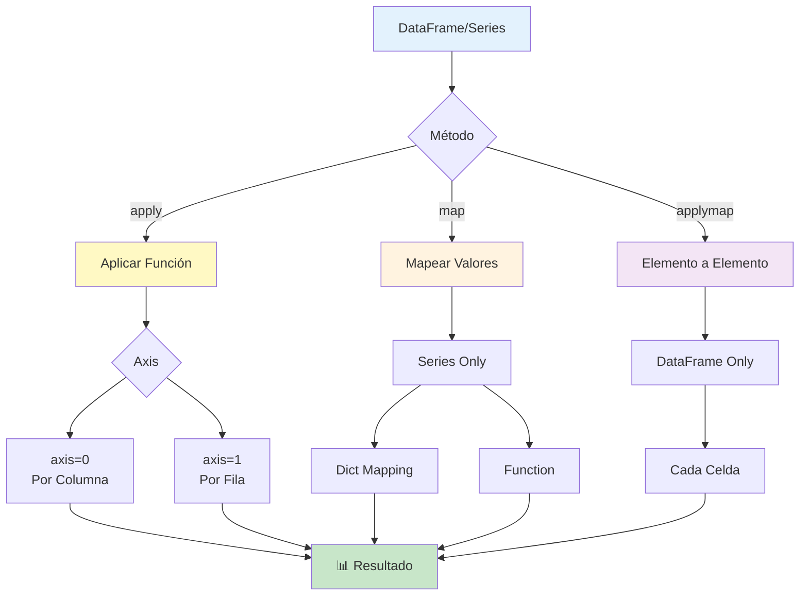

## 🔢 Operaciones Vectorizadas vs Loops

### ❌ Loop (Lento)
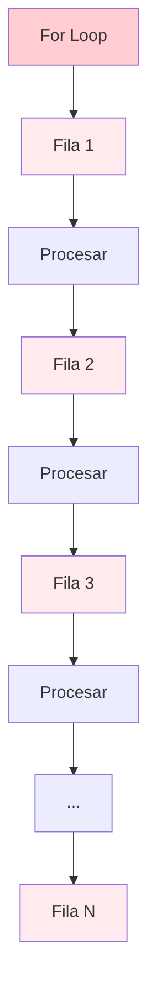

### ✅ Vectorized (Fast)
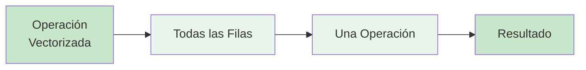

## 🎯 Optimization Strategy

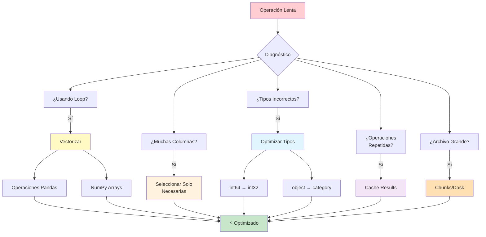

## 💡 Patterns Comunes

### Pattern 1: Filter → Transform → Aggregate
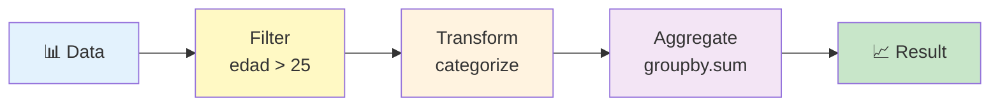

### Pattern 2: Merge → Enrich → Export
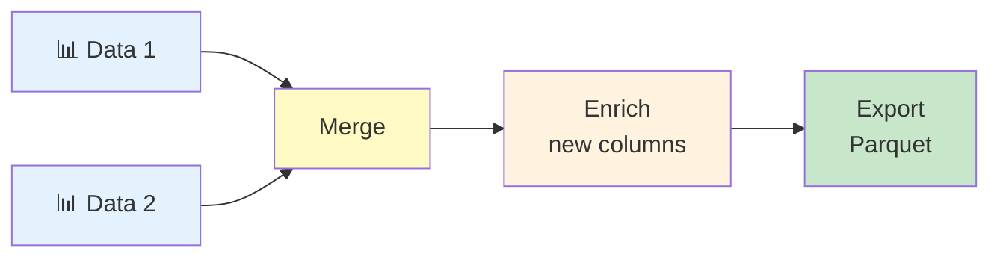

### Pattern 3: Clean → Validate → Load
```mermaid
flowchart LR
    A[📊 Raw] --> B[Clean<br/>nulls/dups]
    B --> C{Validate}
    C -->|✅ Pass| D[Load<br/>Production]
    C -->|❌ Fail| E[Quarantine]
    E --> F[Review]
    
    style A fill:#ffebee
    style B fill:#fff9c4
    style D fill:#c8e6c9
    style E fill:#ffcdd2
```

## 📊 Performance Comparison

```mermaid
flowchart TD
    A[100K Rows Operation] --> B{Método}
    
    B --> C[Python Loop]
    C --> C1[⏱️ 10 segundos]
    
    B --> D[List Comprehension]
    D --> D1[⏱️ 5 segundos]
    
    B --> E[Pandas Apply]
    E --> E1[⏱️ 2 segundos]
    
    B --> F[Pandas Vectorized]
    F --> F1[⏱️ 0.1 segundos]
    
    B --> G[NumPy Vectorized]
    G --> G1[⏱️ 0.05 segundos]
    
    style C fill:#ffcdd2
    style D fill:#ffe0b2
    style E fill:#fff9c4
    style F fill:#c8e6c9
    style G fill:#a5d6a7
```

## 💡 Tips Visuales

### Memory Optimization
```mermaid
flowchart LR
    A[DataFrame<br/>100 MB] --> B{Optimizar}
    B --> C[category dtype<br/>-50%]
    B --> D[int32 vs int64<br/>-25%]
    B --> E[drop unused cols<br/>-30%]
    
    C --> F[DataFrame<br/>25 MB]
    D --> F
    E --> F
    
    style A fill:#ffcdd2
    style F fill:#c8e6c9
```

---

**Note**: These diagrams are rendered in GitHub, VS Code (with extension), and Mermaid Live Editor.

