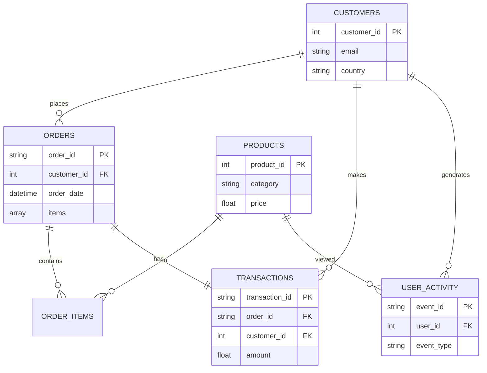

# Practice Datasets: Multi-format E-commerce

This folder contains realistic datasets of an e-commerce system to practice Python data engineering. The data intentionally includes quality issues to simulate real data cleaning and transformation scenarios.

## Estructura de Carpetas

```
data/
├── raw/                      # Datos crudos (sin procesar)
│   ├── customers.csv         # 10,000 clientes
│   ├── orders.json           # 50,000 órdenes (nested)
│   ├── products.parquet      # 500 productos
│   ├── transactions.csv      # 100,000 transacciones
│   └── user_activity.json    # 20,000 eventos (nested)
├── processed/                # Datos limpios (generados por ejercicios)
│   └── (vacío - aquí guardarás tus resultados)
├── schemas/                  # Schemas JSON con documentación
│   ├── customers_schema.json
│   ├── orders_schema.json
│   ├── products_schema.json
│   ├── transactions_schema.json
│   └── user_activity_schema.json
└── README.md                 # Este archivo
```

---

## Datasets Disponibles

### 1. customers.csv (10,000 registros)

**Formato**: CSV  
**Size**: ~1.5 MB
**Encoding**: UTF-8

#### columns

| columns | Type | Description | Nulls | Issues |
|---------|------|-------------|-------|--------|
| `customer_id`| int | Unique customer ID | No | Duplicates (~2%) |
| `first_name`| str | Name | Yes (~5%) | Empty values ​​|
| `last_name`| str | Surname | Yes (~5%) | Empty values ​​|
| `email` | str | Email | Yes (~5%) | Malformados (~2%) |
| `phone`| str | Telephone | Yes (~10%) | Inconsistent formats |
| `country`| str | Country | Yes | 15 countries + nulls |
| `city` | str | Ciudad | Yes | Valores variados |
| `registration_date` | str | Fecha registro | No | 4 formatos diferentes |
| `is_active` | mixed | Estado activo | Yes | Boolean, string, int |
| `loyalty_points` | int | Puntos lealtad | No | Negativos (~2%) |

#### Problemas de Calidad

- ✗ **Duplicados**: ~200 registros con `customer_id` repetido
- ✗ **Emails malformados**: ~2% sin '@'
- ✗ **Fechas inconsistentes**: `YYYY-MM-DD`, `DD/MM/YYYY`, `MM-DD-YYYY`, `YYYY/MM/DD`
- ✗ **is_active variado**: `true`, `false`, `True`, `False`, `1`, `0`, `yes`, `no`, `Y`, `N`
- ✗ **Loyalty points**: Valores negativos (errores) y muy altos (>100k)
- ✗ **Phones**: No standard format

#### Uso

```python
import pandas as pd

# Leer CSV
df = pd.read_csv('data/raw/customers.csv')

# Explorar problemas
print(df.info())
print(df['is_active'].value_counts())
print(df[df.duplicated(subset=['customer_id'], keep=False)])
```

---

### 2. orders.json (50,000 registros)

**Formato**: JSON (array de objetos)  
**Size**: ~50 MB
**Encoding**: UTF-8  
**Estructura**: Nested (items, shipping_address)

#### Campos

| Field | Type | Description | Nulls | Issues |
|-------|------|-------------|-------|--------|
| `order_id` | str | ID de orden | No | Formato inconsistente |
| `customer_id` | int | ID cliente | No | - |
| `order_date` | str | Fecha de orden | No | 2 formatos |
| `status` | str | Estado | Yes | 6 valores + null |
| `payment_method`| str | Payment method | Yes | 5 values ​​+ null |
| `shipping_method`| str | Shipping method | Yes | 4 values ​​+ null |
| `items`| array | Items (nested) | No | Requires explosion |
| `subtotal` | float | Subtotal | No | Inconsistencias |
| `tax` | float | Impuesto | Yes (~3%) | Algunos null |
| `shipping_cost`| float | Shipping cost | No | - |
| `total` | float | Total | No | No suma bien (~5%) |
| `shipping_address`| objects | Address (nested) | Yes (~3%) | Some null |
| `notes` | str | Notas | Yes | Mayormente null |

#### Estructura Nested

**Items** (1-8 por orden):
```json
{
  "product_id": 123,
  "quantity": 2,
  "price": 49.99,
  "subtotal": 99.98
}
```

**Shipping Address**:
```json
{
  "street": "Calle Principal",
  "number": "123",
  "city": "Ciudad de México",
  "state": "CDMX",
  "postal_code": "06100",
  "country": "México"
}
```

#### Problemas de Calidad

- ✗ **order_id**: ~2% formato `123` en vez de `ORD-000123`
- ✗ **Fechas**: ISO 8601 vs `YYYY-MM-DD HH:MM:SS`
- ✗ **Error calculations**: ~5% where`total ≠ subtotal + tax + shipping_cost`
- ✗ **Items nested**: Requires normalization for tabular analysis
- ✗ **Orphan product_ids**: Algunos `product_id` no existen en products
- ✗ **No address**: ~3% of orders without`shipping_address`

#### Uso

```python
import pandas as pd
import json

# Leer JSON
with open('data/raw/orders.json', 'r') as f:
    orders = json.load(f)

df = pd.DataFrame(orders)

# Explorar nested structure
print(df['items'].head())

# Flatten items
from pandas import json_normalize
items_df = json_normalize(
    orders,
    record_path='items',
    meta=['order_id', 'customer_id', 'order_date']
)
```

---

### 3. products.parquet (500 registros)

**Formato**: Apache Parquet (columnr)  
**Size**: ~50 KB (Compressed with Snappy)
**Advantages**: Fast reading, type safety, efficient compression

#### columns

| columns | Type | Description | Nulls | Issues |
|---------|------|-------------|-------|--------|
| `product_id` | int64 | ID producto | No | - |
| `product_name` | str | Nombre | No | - |
| `category`| str | Category | Yes | 9 categories + null |
| `brand` | str | Marca | Yes | 6 marcas + null |
| `price` | float64 | Precio | No | Negativos (~2%) |
| `stock` | int64 | Inventario | No | Negativos (~5%) |
| `rating`| float64 | Rating | Yes (~10%) | Out of range (0-5) |
| `num_reviews`| int64 | # Reviews | No | - |
| `weight_kg` | float64 | Peso | Yes (~10%) | - |
| `length_cm` | float64 | Largo | Yes (~10%) | - |
| `width_cm` | float64 | Ancho | Yes (~10%) | - |
| `height_cm` | float64 | Alto | Yes (~10%) | - |
| `created_at`| datetime64 | Creation date | No | - |
| `is_active` | mixed | Activo | Yes | Boolean/int/null |

#### Categories

- Electronics, Clothing, Home & Garden, Sports, Books
- Toys, Food & Beverage, Beauty, Automotive

#### Problemas de Calidad

- ✗ **Precios negativos**: ~10 productos (errores de sistema)
- ✗ **Precios outliers**: ~5 productos > $10,000
- ✗ **Stock negativo**: ~25 productos (errores de inventario)
- ✗ **Rating fuera de rango**: <0 o >5 (~15 productos)
- ✗ **is_active**: Boolean, 0/1, o null (inconsistente)

#### Uso

```python
import pandas as pd

# Leer Parquet (mucho más rápido que CSV para archivos grandes)
df = pd.read_parquet('data/raw/products.parquet')

# Ver schema
print(df.dtypes)

# Detectar problemas
print(df[df['price'] < 0])  # Precios negativos
print(df[df['stock'] < 0])  # Stock negativo
print(df[(df['rating'] < 0) | (df['rating'] > 5)])  # Rating inválido
```

---

### 4. transactions.csv (100,000 registros)

**Formato**: CSV  
**Size**: ~12 MB
**Encoding**: UTF-8

#### columns

| columns | Type | Description | Nulls | Issues |
|---------|------|-------------|-------|--------|
| `transaction_id` | str | ID transaction | No | - |
| `order_id` | str | ID orden | No | Orphans (~5%) |
| `customer_id` | int | ID cliente | No | - |
| `transaction_date` | str | Fecha/hora | No | 4 formatos |
| `transaction_type` | str | Tipo | Yes | 4 tipos + null |
| `amount` | float | Monto | No | Negativos (refunds) |
| `currency` | str | Moneda | Yes | 5 monedas + null |
| `payment_status` | str | Estado pago | Yes | 4 estados + null |
| `payment_provider` | str | Proveedor | Yes | 5 proveedores + null |
| `fee`| float | Commission | Yes (~10%) | - |
| `net_amount` | float | Monto neto | No | - |

#### Tipos de transaction

- `purchase`: Compra (~80%)
- `refund`: Return (~10%) - negative amount
- `adjustment`: Ajuste (~5%)
- `bonus`: Bonus (~3%)

#### Monedas

- USD, EUR, MXN (Mexican Peso), ARS (Argentine Peso), COP (Colombian Peso)

#### Problemas de Calidad

- ✗ **Orphan order_ids**: ~5% con `order_id` que no existe en orders.json
- ✗ **Fechas inconsistentes**: ISO, `YYYY-MM-DD HH:MM:SS`, `DD/MM/YYYY HH:MM`, `YYYY-MM-DD`
- ✗ **Multiple currencies**: Requires conversion for aggregations
- ✗ **Inconsistent fee**: Some without fees when they should have one
- ✗ **Calculations**: Validate`net_amount = amount - fee`
- ✗ **transactions $0**: ~100 records (valid?)
- ✗ **Outliers**: ~50 transactions > $100,000

#### Uso

```python
import pandas as pd

# Leer CSV
df = pd.read_csv('data/raw/transactions.csv')

# Detectar orphans (requiere join con orders)
import json
with open('data/raw/orders.json') as f:
    orders = json.load(f)
order_ids = {o['order_id'] for o in orders}

orphans = df[~df['order_id'].isin(order_ids)]
print(f"Orphan transactions: {len(orphans)}")

# Analizar por tipo
print(df.groupby('transaction_type')['amount'].agg(['count', 'sum', 'mean']))
```

---

### 5. user_activity.json (20,000 registros)

**Formato**: JSON (array de objetos)  
**Size**: ~15 MB
**Encoding**: UTF-8  
**Estructura**: Nested (device, location)

#### Campos

| Field | Type | Description | Nulls | Issues |
|-------|------|-------------|-------|--------|
| `event_id` | str | ID evento | No | - |
| `user_id`| int | User ID | Yes (~2%) | Anonymous |
| `session_id`| str | Session ID | No | - |
| `timestamp` | str | Timestamp | No | 2 formatos |
| `event_type` | str | Tipo evento | Yes | 10 tipos + null |
| `page_url`| str | URL page | Yes (~5%) | - |
| `referrer` | str | Referrer | Yes | 3 valores + null |
| `device` | object | Device (nested) | Yes (~5%) | - |
| `location` | object | Location (nested) | Yes (~5%) | - |
| `product_id` | int | ID producto | Yes (~70%) | Solo si aplica |
| `search_query`| str | Query search | Yes (~70%) | Searches only |
| `duration_seconds`| int | Duration | Yes (~20%) | - |

#### Event Types

- `page_view`(~40%): Page View
- `click` (~20%): Click en elemento
- `search`(~15%): Search
- `add_to_cart` (~10%): Agregar al carrito
- `remove_from_cart` (~5%): Remover del carrito
- `checkout`, `purchase`, `login`, `logout`, `review`

#### Estructura Nested

**Device**:
```json
{
  "type": "mobile",
  "browser": "Chrome",
  "os": "Android",
  "screen_resolution": "1920x1080"
}
```

**Location**:
```json
{
  "country": "México",
  "city": "Ciudad de México",
  "ip_address": "192.168.1.1"
}
```

#### Problemas de Calidad

- ✗ **user_id null**: ~2% anonymous events (user not logged in)
- ✗ **Timestamps**: ISO 8601 vs Unix timestamp (segundos desde epoch)
- ✗ **Nested objects**: device y location requieren flattening
- ✗ **Nulls completos**: device o location completamente null (~5%)
- ✗ **referrer**: `''` vs `null` (inconsistencia)

#### Casos de Uso

```python
import pandas as pd
import json
from datetime import datetime

# Leer JSON
with open('data/raw/user_activity.json') as f:
    events = json.load(f)

df = pd.DataFrame(events)

# Flatten device
device_df = pd.json_normalize(df['device'])
device_df.columns = ['device_' + col for col in device_df.columns]
df = pd.concat([df, device_df], axis=1)

# Convertir timestamps
def parse_timestamp(ts):
    try:
        # Unix timestamp
        return datetime.fromtimestamp(int(ts))
    except:
        # ISO 8601
        return pd.to_datetime(ts)

df['timestamp'] = df['timestamp'].apply(parse_timestamp)

# Conversion funnel
funnel_steps = ['page_view', 'search', 'click', 'add_to_cart', 'checkout', 'purchase']
funnel = df[df['event_type'].isin(funnel_steps)].groupby('event_type').size()
print(funnel)
```

---

## Relaciones Entre Datasets



### Foreign Keys

- `orders.customer_id` → `customers.customer_id`
- `transactions.order_id` → `orders.order_id` (⚠️ ~5% orphans)
- `transactions.customer_id` → `customers.customer_id`
- `orders.items[].product_id` → `products.product_id`
- `user_activity.user_id` → `customers.customer_id` (⚠️ ~2% nulls)

---

## Problemas de Calidad - Resumen

### Por Severidad

#### 🔴 Critical (Requires immediate correction)

1. **Duplicados en customers**: ~200 registros con mismo customer_id
2. **Incorrect calculations in orders**: ~2,500 orders where total ≠ sum of components
3. **Orphan transactions**: ~5,000 transactions sin orden correspondiente
4. **Precios/stock negativos en products**: Datos imposibles

#### 🟡 Medium (Affects analysis)

1. **Formatos de fecha inconsistentes**: 4-5 formatos diferentes
2. **Valores booleanos inconsistentes**: true/false/1/0/yes/no
3. **Emails malformados**: ~200 sin '@'
4. **Nested structures**: Requires flatten for analysis

#### 🟢 Bajo (Molestias menores)

1. **Valores nulos**: Estrategia a definir
2. **Multiple currencies**: Requires conversion
3. **Formato de order_id inconsistente**: ~1,000 sin prefijo

---

## Ejercicios Sugeridos

### 1. Data Quality Assessment

**Objetivo**: Detectar y documentar todos los problemas de calidad

**Tareas**:
- Contar duplicados, nulls, valores fuera de rango
- Validar foreign keys
- Generar reporte de calidad

### 2. Data Cleaning

**Objetivo**: Limpiar y estandarizar todos los datasets

**Tareas**:
- Eliminar duplicados
- Estandarizar fechas, booleanos, formatos
- Correct/remove abnormal values
- Fill or delete nulls (with justification)

### 3. Data Transformation

**Goal**: Prepare data for analysis

**Tareas**:
- Flatten estructuras nested
- Convertir monedas a USD
- Crear tables dimensionales (star schema)
- Calculate derived metrics

### 4. Data Validation

**Objetivo**: Validar integridad referencial y business rules

**Tareas**:
- Validar foreign keys
- Validate calculations (totals, fees, etc.)
- Validar business rules (refunds negativos, etc.)

### 5. Exploratory Data Analysis

**Objective**: Understand the business through data

**Tareas**:
- Top products/categories
- Customer Cohort Analysis
- Conversion funnel
- Temporal analysis (trends, seasonality)

### 6. pipeline End-to-End

**Objetivo**: Construir pipeline completo de datos

**Tareas**:
- Extract: Read multiple formats
- Transform: Limpiar, flatten, join
- Load: Save in processed/ in optimal format
- Agregar logging, error handling, tests

---

## Useful Commands

### Quick Scan

```bash
# Ver tamaños de archivos
ls -lh data/raw/

# Contar líneas en CSV
wc -l data/raw/customers.csv
wc -l data/raw/transactions.csv

# Ver primeras líneas
head -n 5 data/raw/customers.csv

# Verificar encoding
file -i data/raw/*.csv
```

### Python Quick Check

```python
import pandas as pd
import json

# Cargar todos los datasets
customers = pd.read_csv('data/raw/customers.csv')
products = pd.read_parquet('data/raw/products.parquet')
transactions = pd.read_csv('data/raw/transactions.csv')

with open('data/raw/orders.json') as f:
    orders = pd.DataFrame(json.load(f))

with open('data/raw/user_activity.json') as f:
    activity = pd.DataFrame(json.load(f))

# Resumen rápido
print("="*50)
print("DATASET SUMMARY")
print("="*50)
for name, df in [('Customers', customers), ('Products', products), 
                  ('Transactions', transactions), ('Orders', orders), 
                  ('Activity', activity)]:
    print(f"\n{name}:")
    print(f"  Rows: {len(df):,}")
    print(f"  Columns: {len(df.columns)}")
    print(f"  Nulls: {df.isnull().sum().sum():,}")
    print(f"  Duplicates: {df.duplicated().sum():,}")
    print(f"  Memory: {df.memory_usage(deep=True).sum() / 1024**2:.2f} MB")
```

---

## File Formats - Comparison

| Formato | Ventajas | Desventajas | Mejor Para |
|---------|----------|-------------|------------|
| **CSV** | Simple, readable, universal | No types, big, slow | Small tabular data |
| **JSON** | Flexible, nested data | Verbose, slow, without types | APIs, configuration |
| **Parquet** | Compact, fast, typed | Not readable, requires libs | Big data, analytics |

### Benchmark (1M rows, 10 columns)

| Operation | CSV | JSON | Parquet |
|-----------|-----|------|---------|
| Size | 500MB | 800MB | 80MB |
| Lectura | 15s | 25s | 2s |
| Escritura | 20s | 30s | 3s |

---

## Next Steps

After familiarizing yourself with the data:

1. **Explore**: Use Jupyter notebooks for interactive exploration
2. **Limpiar**: Implementa pipeline de limpieza (Ejercicio 03)
3. **Transformar**: Practica operaciones con pandas (Ejercicio 04)
4. **Validar**: Escribe tests para validar calidad (Ejercicio 06)
5. **Analizar**: Genera insights de negocio (Ejercicio 05)

---

## resources Adicionales

### Documentation

- **Pandas**: https://pandas.pydata.org/docs/
- **PyArrow (Parquet)**: https://arrow.apache.org/docs/python/
- **JSON Schema**: https://json-schema.org/

### Herramientas

- **Pandas Profiling**: Generate automatic quality reports
  ```bash
  pip install ydata-profiling
  ```
  ```python
  from ydata_profiling import ProfileReport
  profile = ProfileReport(df, title="Data Quality Report")
  profile.to_file("report.html")
  ```

- **Great Expectations**: Data Validation Framework
  ```python
  import great_expectations as gx
  ```

- **DuckDB**: SQL sobre Parquet sin cargar en memoria
  ```python
  import duckdb
  duckdb.sql("SELECT * FROM 'data/raw/products.parquet' WHERE price < 0")
  ```

---

**Questions about the data?**

Revisa los schemas en `data/schemas/` para detalles completos de cada dataset, incluyendo problemas de calidad esperados y recomendaciones de limpieza.

**Happy date wrangling! 🐼**
