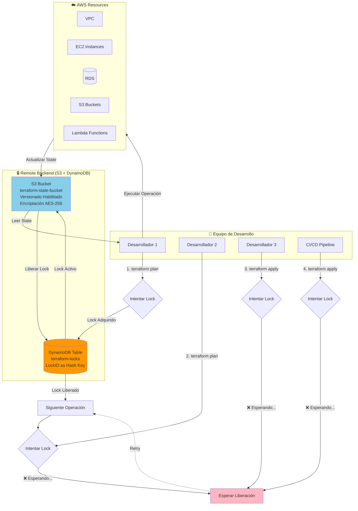
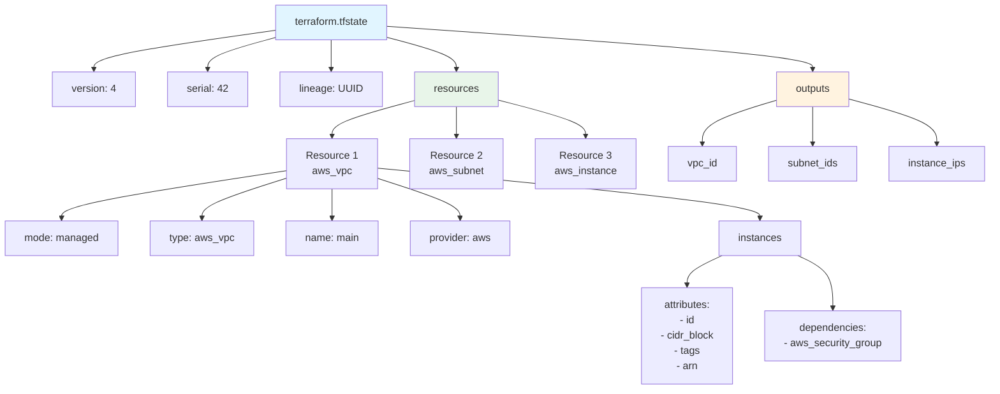
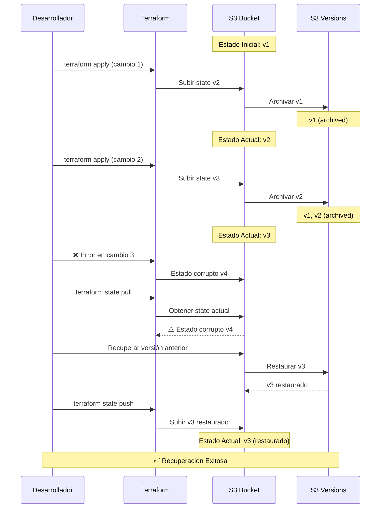
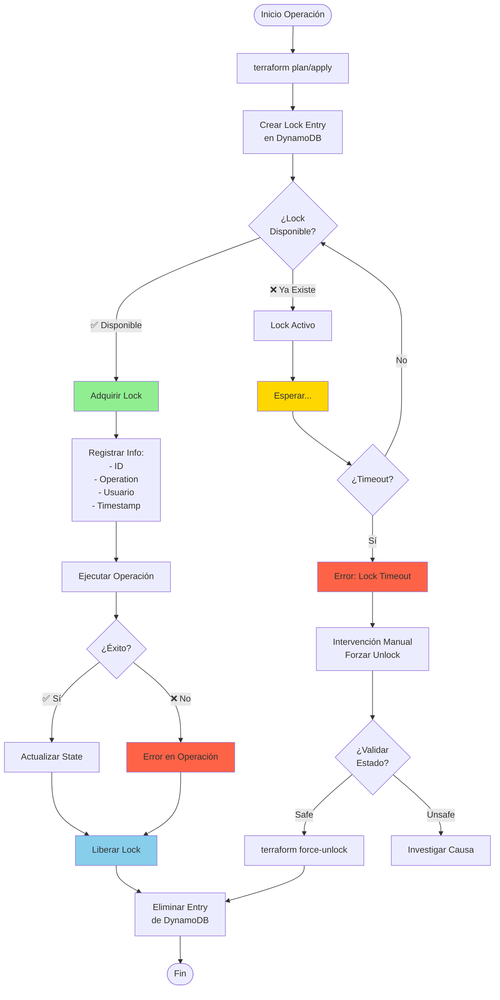
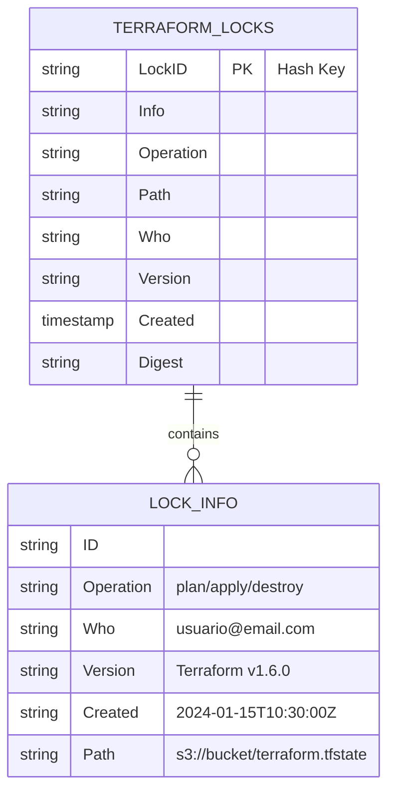
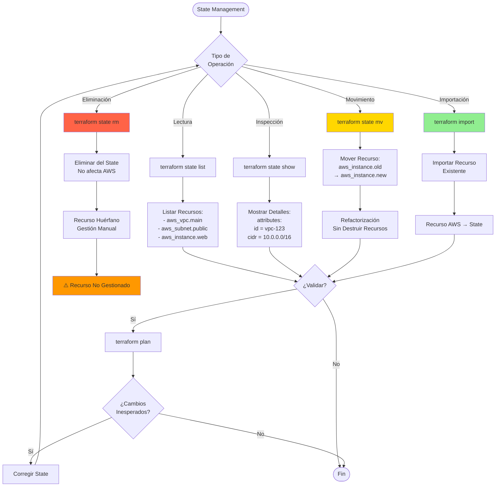
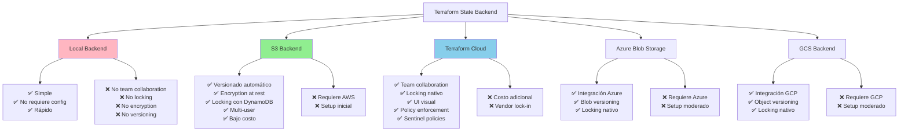
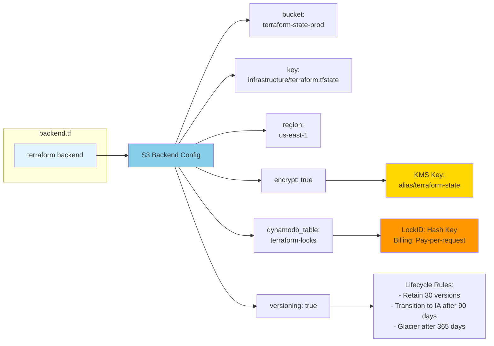
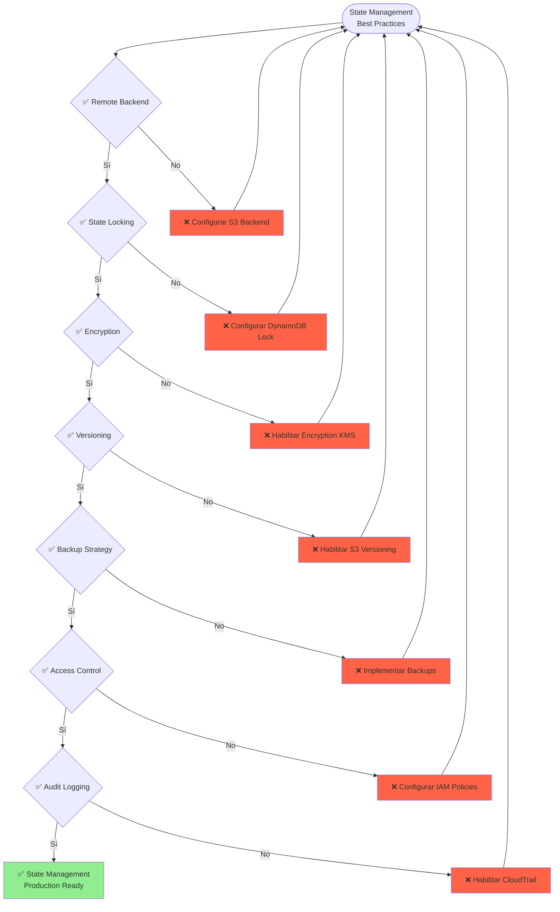

# Gestión de Estado de Terraform (State Management)

## Arquitectura del Remote State con S3 Backend

## State File Structure

## State File Versioning con S3

## State Locking con DynamoDB

## DynamoDB Lock Table Structure

## State Operations Workflow

## State Backends Comparison

## State Backend Configuration

## Best Practices Checklist

## Uso

Estos diagramas muestran:
1. Arquitectura completa del remote state con S3 y DynamoDB
2. Estructura interna del state file
3. Sistema de versionado automático con S3
4. Mecanismo de state locking para prevenir conflictos
5. Estructura de la tabla DynamoDB para locks
6. Operaciones comunes sobre el state
7. Comparación de diferentes backends
8. Configuration del backend
9. Checklist de best practices

Para más información, consulta la documentación oficial de Terraform sobre [State Management](https://www.terraform.io/docs/language/state/).
