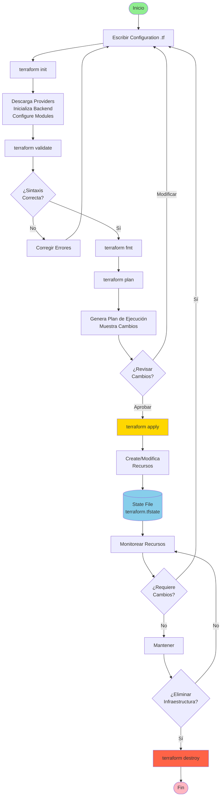
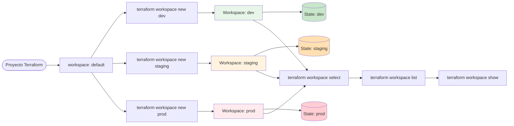
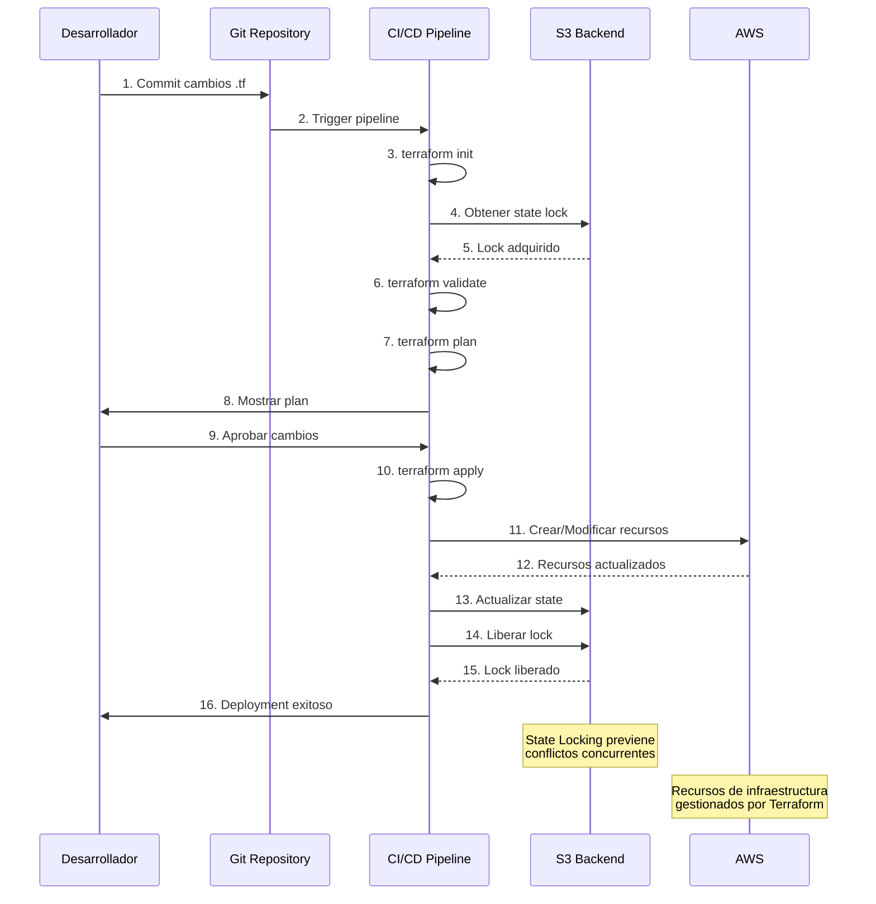
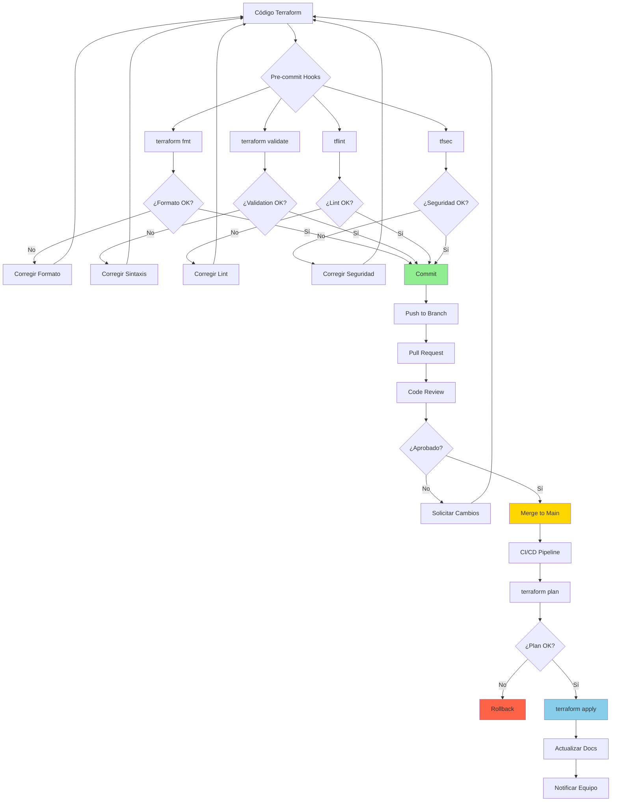

# Flujo de Trabajo de Terraform

## Diagrama del Ciclo de Vida de Terraform

## Comandos Principales

```mermaid
graph LR
    subgraph "Inicialización"
        A[terraform init] --> B[terraform validate]
        B --> C[terraform fmt]
    end

    subgraph "Planificación"
        C --> D[terraform plan]
        D --> E[terraform plan -out=plan.tfplan]
    end

    subgraph "Aplicación"
        E --> F[terraform apply]
        F --> G[terraform apply plan.tfplan]
    end

    subgraph "Gestión"
        G --> H[terraform show]
        H --> I[terraform state list]
        I --> J[terraform output]
    end

    subgraph "Limpieza"
        J --> K[terraform destroy]
    end

    style A fill:#E1F5FF
    style D fill:#FFF4E1
    style F fill:#FFE1E1
    style K fill:#FFB6C1
```

## Gestión de Workspaces

## Flujo de Trabajo en Equipo

## Best Practices Flow

## Uso

Estos diagramas muestran:
1. El ciclo de vida completo de Terraform
2. Los comandos principales y su secuencia
3. Gestión de múltiples workspaces
4. Flujo de trabajo colaborativo con state locking
5. Best practices y validaciones pre-commit

Para visualizar estos diagramas en VS Code, instala la extensión "Markdown Preview Mermaid Support".
