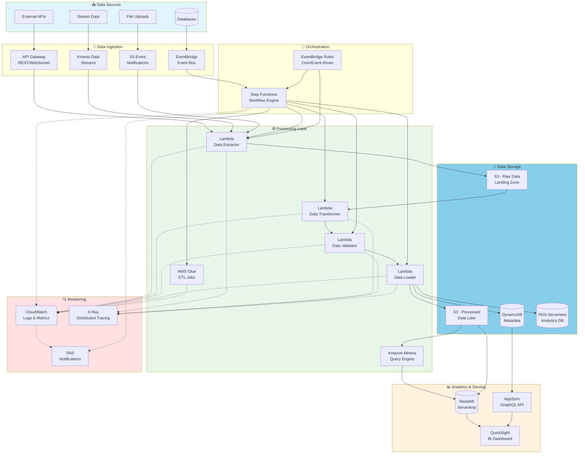
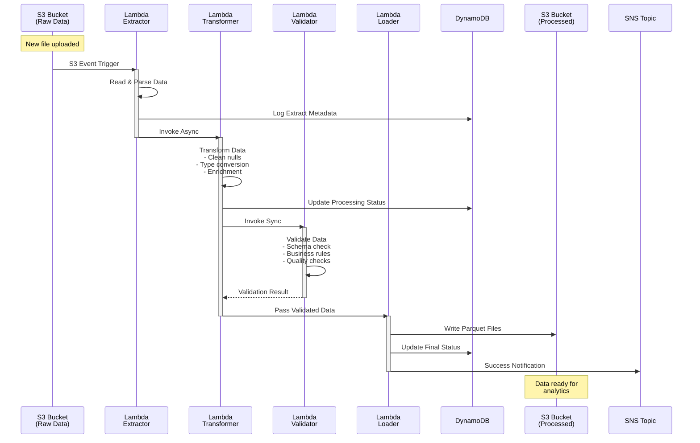
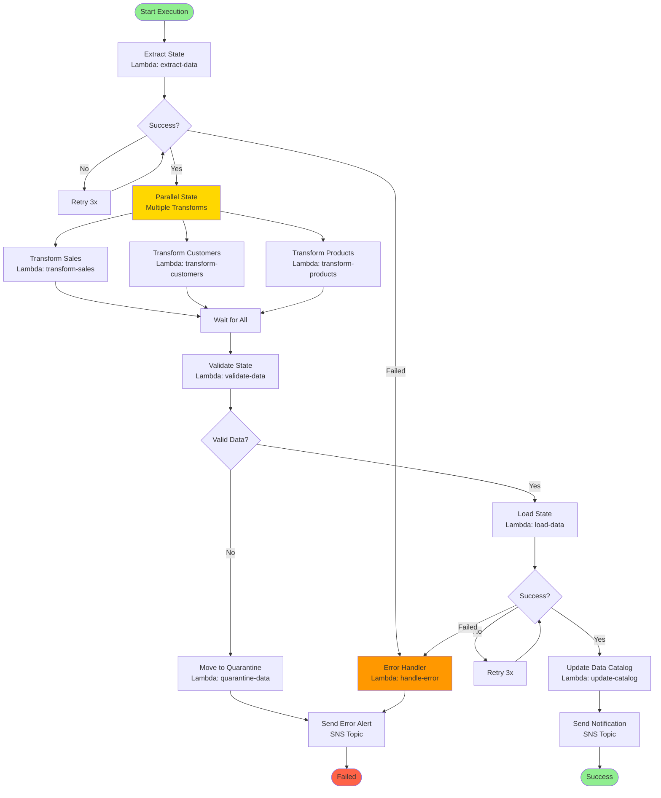
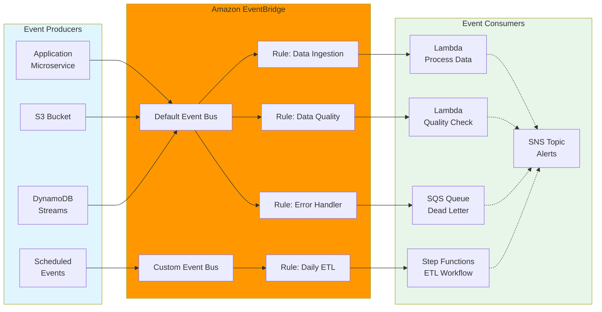
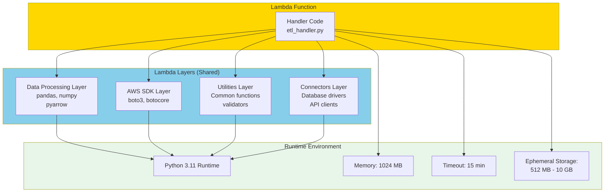
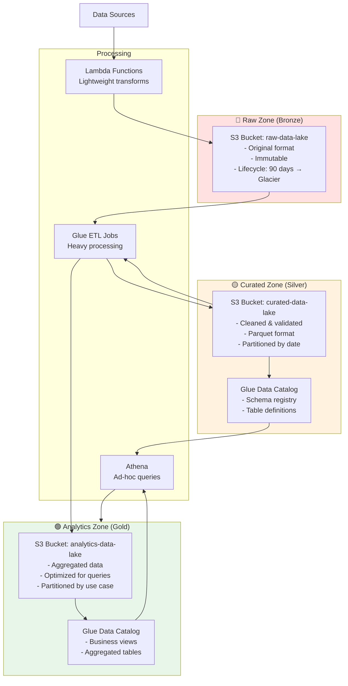
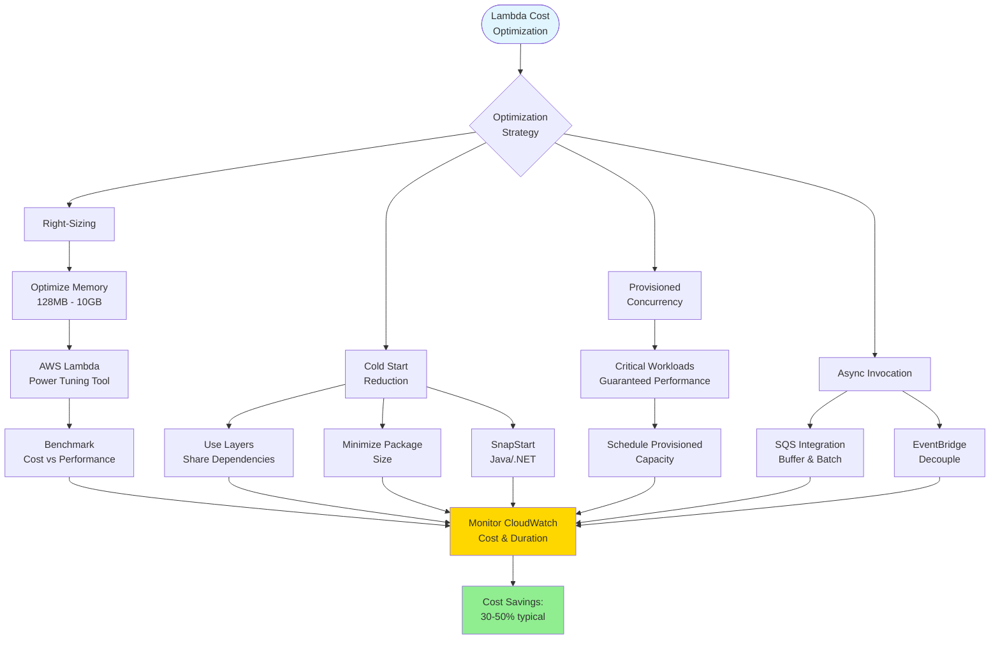
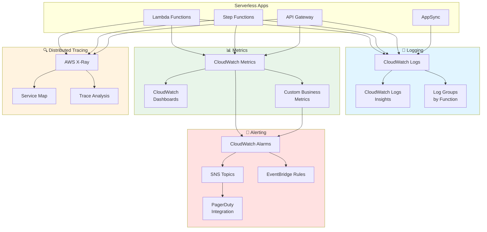

# Arquitectura Serverless para Data Engineering

## Arquitectura Completa Serverless Data Platform

## Lambda ETL Pipeline Flow

## Step Functions State Machine para ETL Complejo

## Event-Driven Architecture con EventBridge

## Lambda Layer Architecture para Data Processing

## Serverless Data Lake Zones

## Lambda Cost Optimization Strategies

## Serverless Observability Stack

## Uso

Estos diagramas muestran:
1. Arquitectura completa de una plataforma de datos serverless
2. Flujo de ejecución de un pipeline ETL con Lambda
3. Step Functions para orquestación compleja con manejo de errores
4. Arquitectura event-driven con EventBridge
5. Estructura de Lambda Layers para compartir código
6. Zonas del data lake (Bronze, Silver, Gold)
7. Estrategias de optimización de costos
8. Stack de observabilidad serverless

Para más información, consulta la [documentación de AWS Lambda](https://docs.aws.amazon.com/lambda/) y [AWS Step Functions](https://docs.aws.amazon.com/step-functions/).
