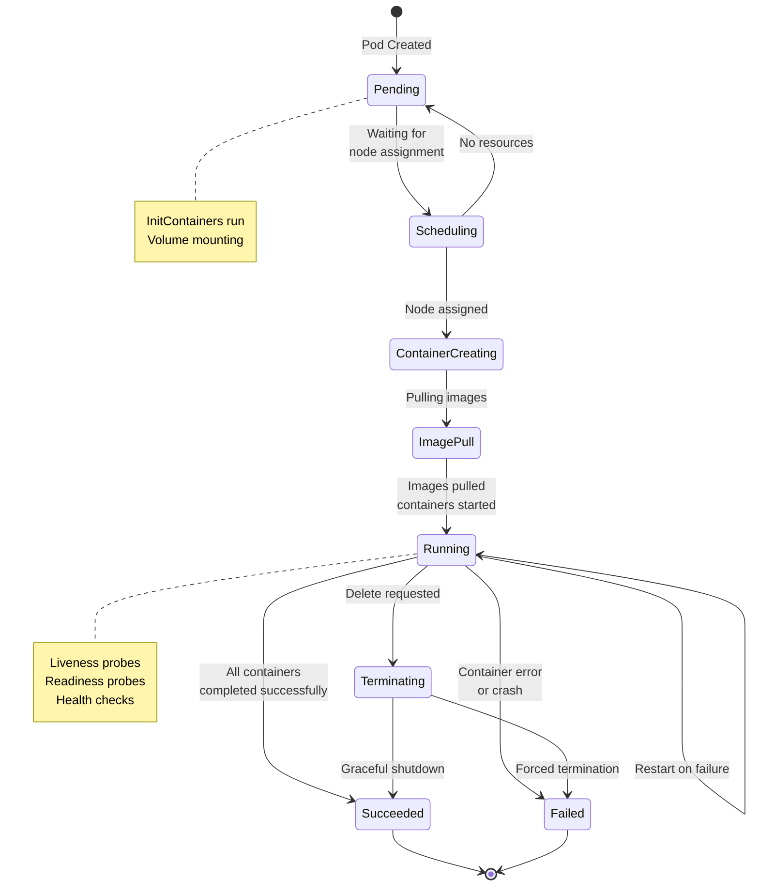
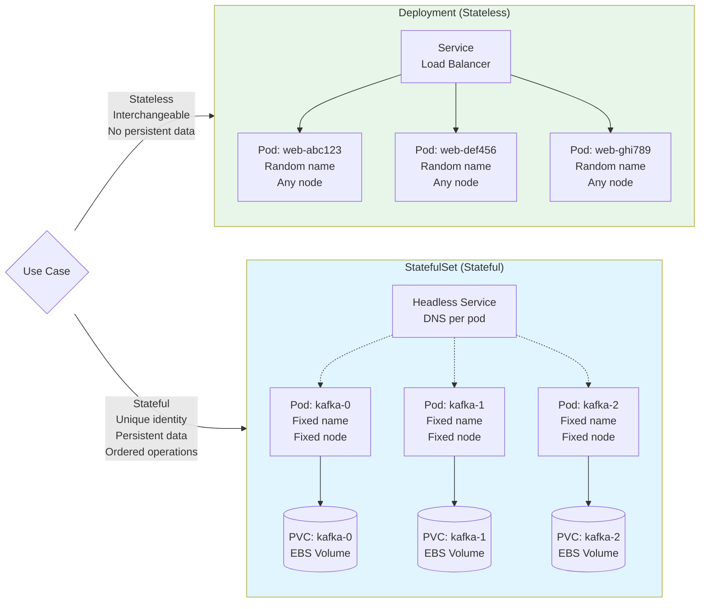
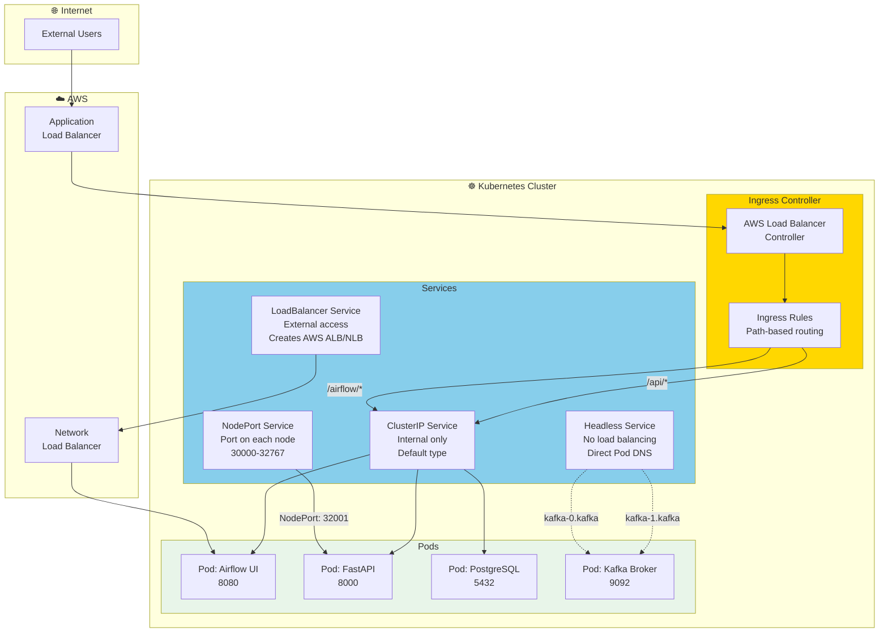
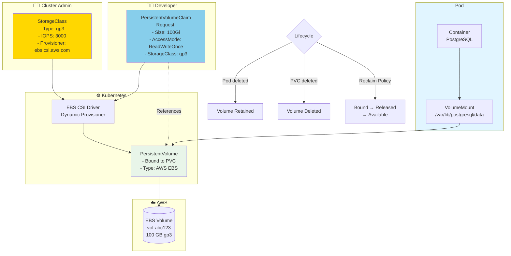
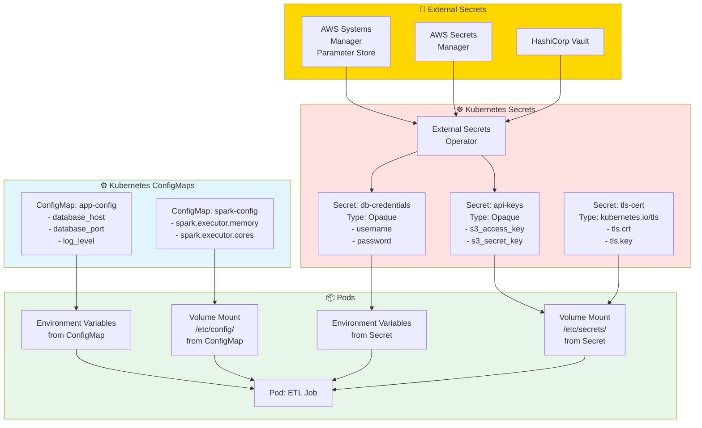
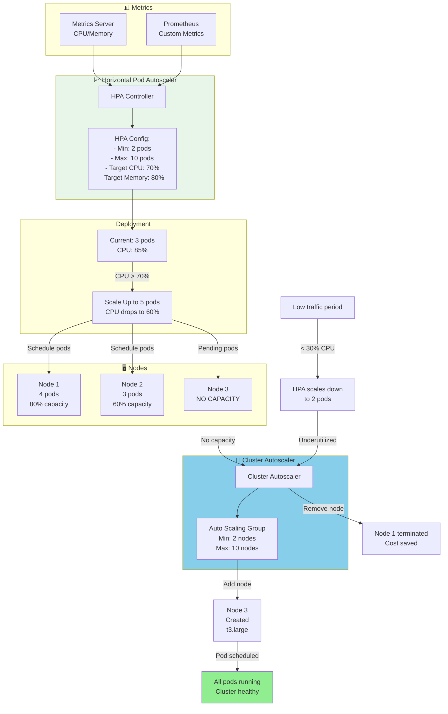
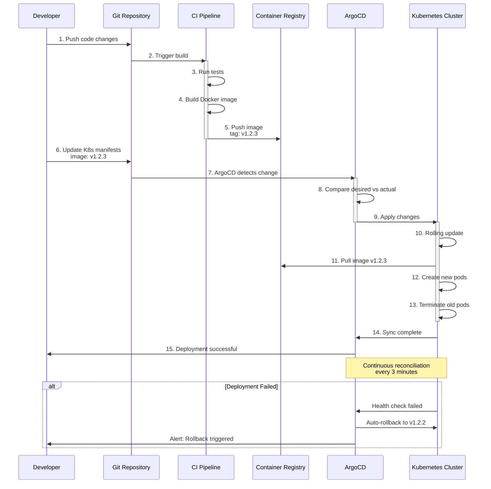

# Kubernetes: Patrones de Deployment para Data Engineering

## Pod Lifecycle y Estados



## Deployment Strategies

```mermaid
flowchart TB
    Start([Deployment Update]) --> Strategy{Strategy<br/>Type}

    Strategy --> RollingUpdate[Rolling Update<br/>Default Strategy]
    Strategy --> Recreate[Recreate<br/>All at once]
    Strategy --> BlueGreen[Blue/Green<br/>Zero downtime]
    Strategy --> Canary[Canary<br/>Gradual rollout]

    subgraph Rolling["🔄 Rolling Update"]
        R1[Current: 3 pods<br/>v1.0]
        R2[Create 1 pod v1.1]
        R3[Total: 4 pods<br/>3x v1.0, 1x v1.1]
        R4[Delete 1 pod v1.0]
        R5[Repeat until<br/>all v1.1]

        R1 --> R2 --> R3 --> R4 --> R5
    end

    subgraph Rec["♻️ Recreate"]
        RC1[Current: 3 pods v1.0]
        RC2[Delete all pods]
        RC3[Downtime ⚠️]
        RC4[Create 3 pods v1.1]

        RC1 --> RC2 --> RC3 --> RC4
    end

    subgraph BG["🔵🟢 Blue/Green"]
        BG1[Blue: 3 pods v1.0<br/>Receiving traffic]
        BG2[Green: 3 pods v1.1<br/>Warmup]
        BG3[Switch Service<br/>to Green]
        BG4[Green active<br/>Blue standby]
        BG5[Delete Blue]

        BG1 --> BG2 --> BG3 --> BG4 --> BG5
    end

    subgraph Can["🐤 Canary"]
        C1[Current: 10 pods v1.0<br/>100% traffic]
        C2[Add 1 pod v1.1<br/>10% traffic]
        C3[Monitor metrics<br/>30 minutes]
        C4{Healthy?}
        C5[Increase to 50%<br/>5 pods v1.1]
        C6[Rollback to v1.0]
        C7[Complete: v1.1<br/>100% traffic]

        C1 --> C2 --> C3 --> C4
        C4 -->|Yes| C5 --> C7
        C4 -->|No| C6
    end

    RollingUpdate --> Rolling
    Recreate --> Rec
    BlueGreen --> BG
    Canary --> Can

    style Rolling fill:#E8F5E9
    style Rec fill:#FFE1E1
    style BG fill:#E1F5FF
    style Can fill:#FFF3E0
```



## StatefulSet vs Deployment



## Service Types y Network Architecture



## Storage: PersistentVolume and PersistentVolumeClaim



## ConfigMaps and Secrets Management



## Auto-Scaling: HPA + Cluster Autoscaler



## Deployment Workflow: GitOps with ArgoCD



## Resource Management: Requests vs Limits

```mermaid
flowchart TB
    subgraph Pod["Pod Specification"]
        Container[Container Definition]
    end

    Container --> Resources{Resources}

    Resources --> Requests[Requests<br/>Guaranteed minimum]
    Resources --> Limits[Limits<br/>Maximum allowed]

    subgraph Req["📊 Requests"]
        ReqCPU[cpu: 500m<br/>0.5 cores<br/>guaranteed]
        ReqMem[memory: 1Gi<br/>1 GB guaranteed]

        ReqSched[Used for:<br/>- Scheduling decisions<br/>- Node selection<br/>- QoS class]
    end

    subgraph Lim["🚫 Limits"]
        LimCPU[cpu: 2000m<br/>2 cores maximum<br/>throttled if exceeded]
        LimMem[memory: 4Gi<br/>4 GB maximum<br/>killed if exceeded]

        LimEnforce[Enforced by:<br/>- cgroups (CPU)<br/>- OOM killer (Memory)]
    end

    Requests --> Req
    Limits --> Lim

    subgraph QoS["Quality of Service Classes"]
        Guaranteed[Guaranteed<br/>Requests = Limits<br/>Highest priority]

        Burstable[Burstable<br/>Requests < Limits<br/>Medium priority]

        BestEffort[BestEffort<br/>No requests/limits<br/>Lowest priority]
    end

    Req --> QoSLogic{QoS<br/>Class}
    Lim --> QoSLogic

    QoSLogic -->|Requests = Limits| Guaranteed
    QoSLogic -->|Requests < Limits| Burstable
    QoSLogic -->|No values| BestEffort

    subgraph Eviction["Pod Eviction Order"]
        E1[1. BestEffort pods<br/>evicted first]
        E2[2. Burstable pods<br/>exceeding requests]
        E3[3. Guaranteed pods<br/>last resort]

        E1 --> E2 --> E3
    end

    QoSLogic --> Eviction

    style Req fill:#E8F5E9
    style Lim fill:#FFE1E1
    style Guaranteed fill:#90EE90
    style Burstable fill:#FFD700
    style BestEffort fill:#FF9800
```

## Uso

Estos diagramas muestran:
1. Pod lifecycle y estados en Kubernetes
2. Estrategias de deployment (Rolling, Recreate, Blue/Green, Canary)
3. Diferencias entre Deployment y StatefulSet
4. Service types y arquitectura de red
5. PersistentVolume y claims para storage
6. ConfigMaps y Secrets management
7. Auto-scaling con HPA y Cluster Autoscaler
8. GitOps workflow con ArgoCD
9. Resource requests vs limits y QoS classes

Para más información, consulta la [documentación oficial de Kubernetes](https://kubernetes.io/docs/).
