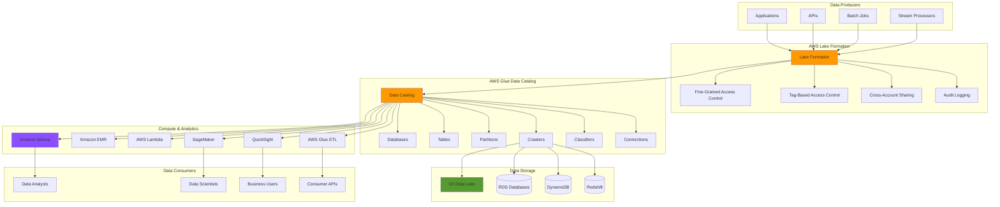
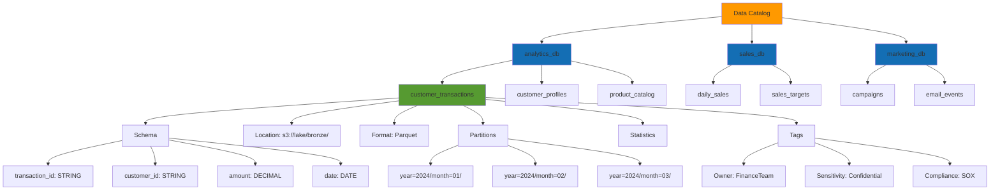
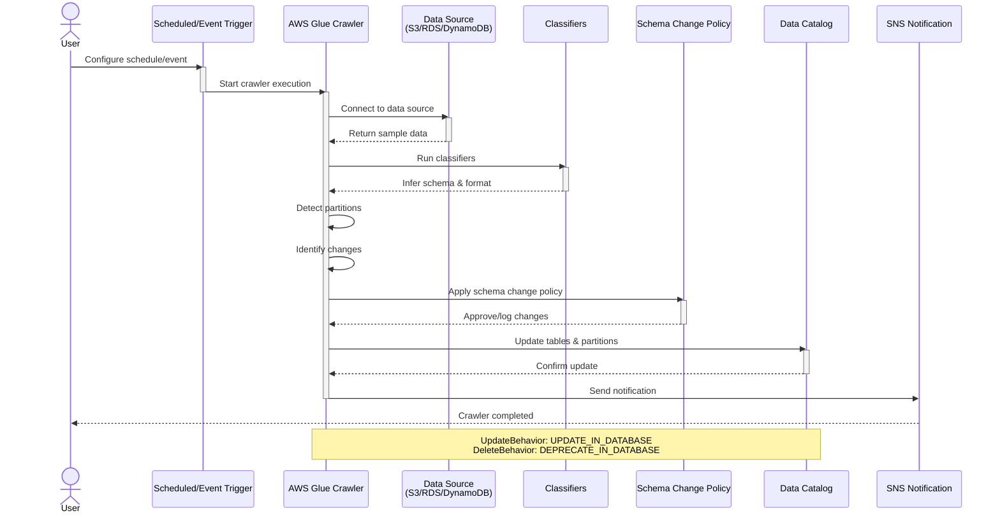
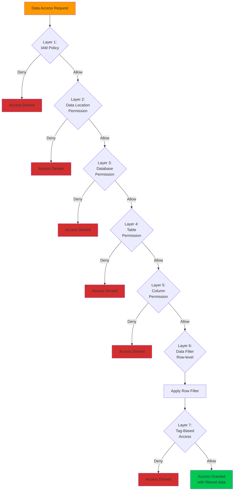
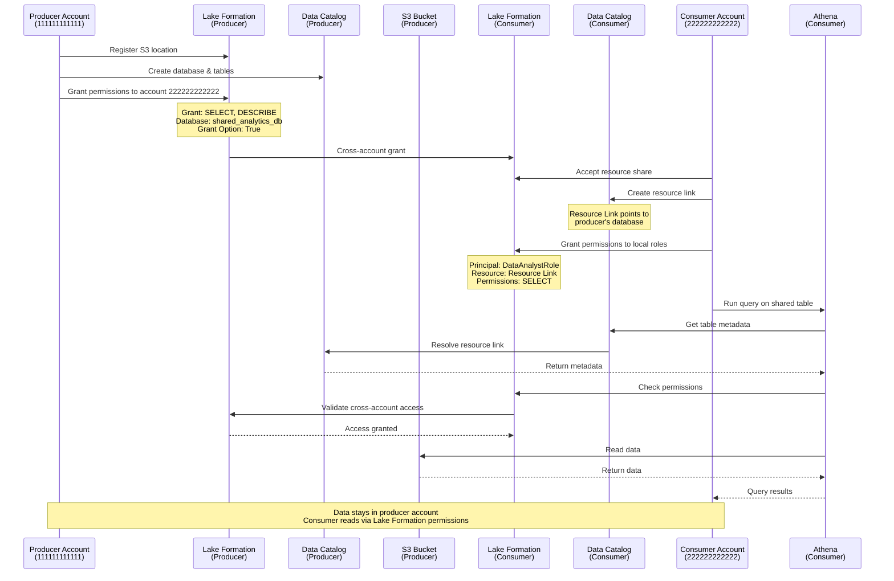
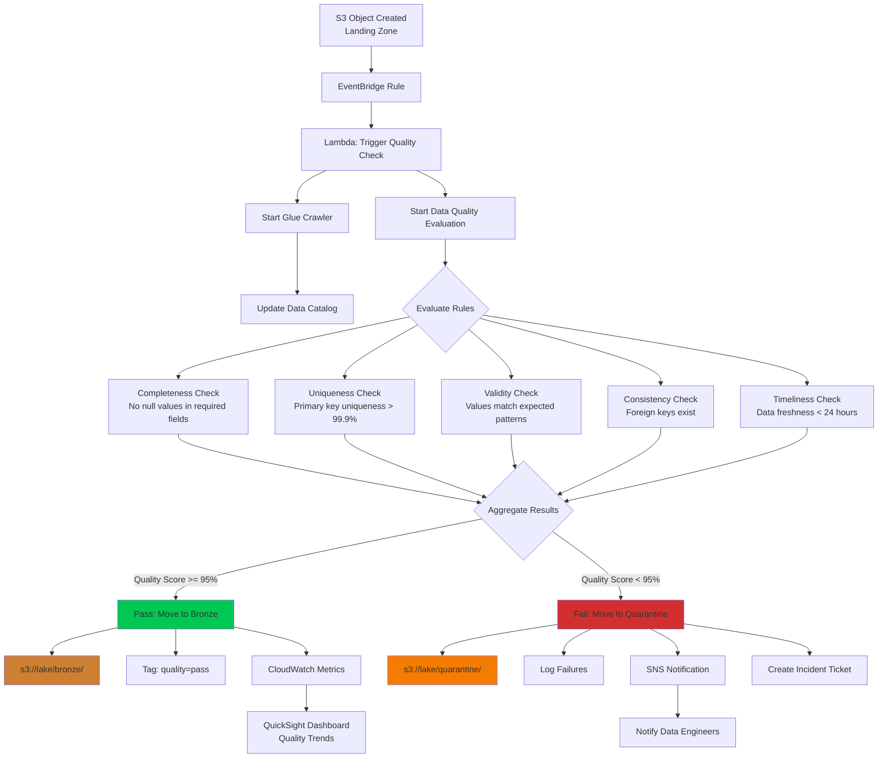
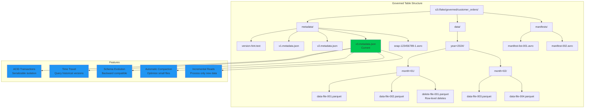
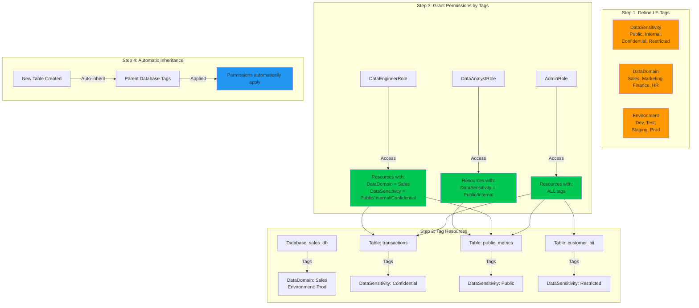
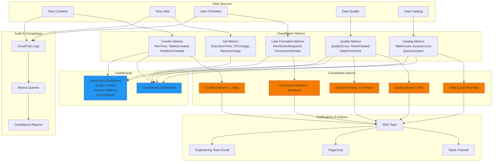

# Data Catalog & Governance Architecture Diagrams

This document contains architectural diagrams for AWS Glue Data Catalog and Lake Formation using Mermaid syntax.

## 1. Complete Data Governance Platform

## 2. Data Catalog Organization

## 3. Crawler Execution Flow

## 4. Lake Formation Permission Model

## 5. Data Lineage Flow

```mermaid
graph LR
    subgraph "Source Systems"
        SF[Salesforce API]
        S3Raw[S3 Landing Zone]
        RDS[(RDS Database)]
    end

    subgraph "Bronze Layer"
        Bronze1[raw_sales_data]
        Bronze2[raw_customer_data]
    end

    subgraph "Silver Layer"
        Silver1[silver_sales_data]
        Silver2[silver_customer_data]
        Silver3[silver_enriched_sales]
    end

    subgraph "Gold Layer"
        Gold1[daily_sales_summary]
        Gold2[customer_purchase_patterns]
        Gold3[customer_lifetime_value]
    end

    subgraph "Consumption"
        Dashboard[QuickSight Dashboard]
        ML[ML Model: Churn Prediction]
        API[Analytics API]
    end

    subgraph "Glue Jobs"
        Job1[glue_job_ingest]
        Job2[glue_job_bronze_to_silver]
        Job3[glue_job_silver_aggregation]
        Job4[glue_job_customer_analytics]
    end

    SF -->|Job1| Bronze1
    S3Raw -->|Job1| Bronze1
    RDS -->|Job1| Bronze2

    Bronze1 -->|Job2<br/>filter, deduplicate| Silver1
    Bronze2 -->|Job2<br/>clean, standardize| Silver2

    Silver1 -->|Job4<br/>join| Silver3
    Silver2 -->|Job4<br/>join| Silver3

    Silver1 -->|Job3<br/>aggregate| Gold1
    Silver3 -->|Job4<br/>compute metrics| Gold2
    Gold2 -->|calculate| Gold3

    Gold1 --> Dashboard
    Gold2 --> ML
    Gold3 --> API

    style Bronze1 fill:#CD7F32
    style Bronze2 fill:#CD7F32
    style Silver1 fill:#C0C0C0
    style Silver2 fill:#C0C0C0
    style Silver3 fill:#C0C0C0
    style Gold1 fill:#FFD700
    style Gold2 fill:#FFD700
    style Gold3 fill:#FFD700
```

## 6. Cross-Account Data Sharing

## 7. Data Quality Pipeline

## 8. Governed Tables Architecture (Apache Iceberg)

## 9. Tag-Based Access Control (TBAC)

## 10. Monitoring and Observability

## Usage Notes

These diagrams illustrate key architectural patterns for Data Catalog and Governance:

1. **Complete Platform**: End-to-end governance architecture
2. **Catalog Organization**: How databases, tables, and metadata are structured
3. **Crawler Execution**: Step-by-step crawler process flow
4. **Permission Model**: Multi-layer security and access control
5. **Data Lineage**: Tracking data flow from source to consumption
6. **Cross-Account Sharing**: Secure data sharing between AWS accounts
7. **Quality Pipeline**: Automated data quality validation workflow
8. **Governed Tables**: Apache Iceberg table structure and features
9. **TBAC**: Tag-based access control implementation
10. **Monitoring**: Comprehensive observability and alerting

To render these diagrams:
- Use VS Code with the Mermaid extension
- View in GitHub (native Mermaid support)
- Use online tools like [Mermaid Live Editor](https://mermaid.live/)
- Export to PNG/SVG for documentation
