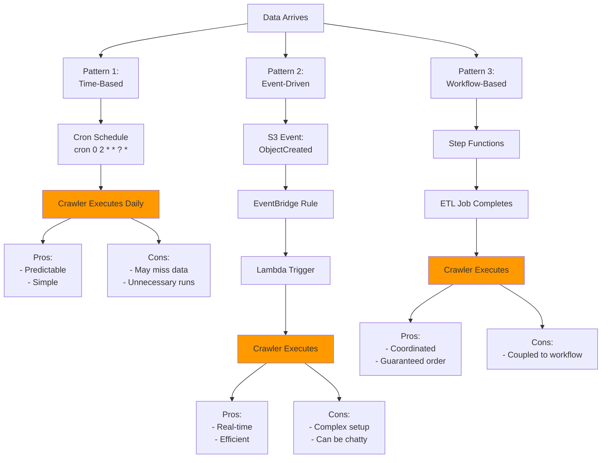
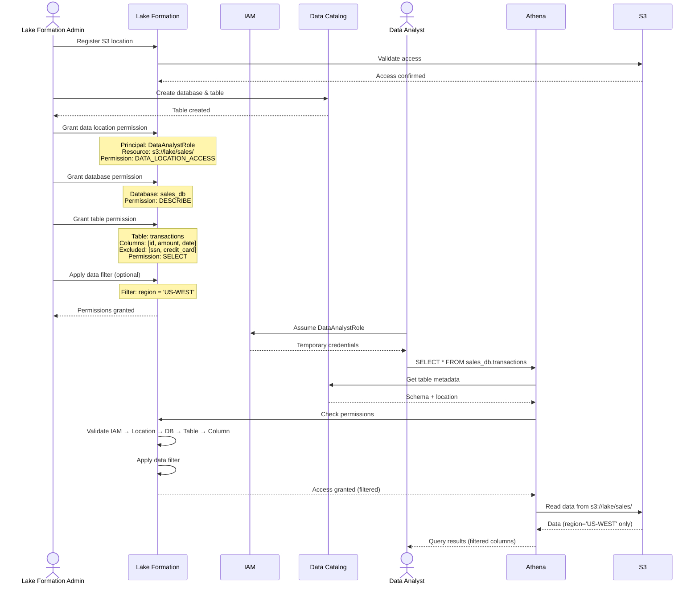
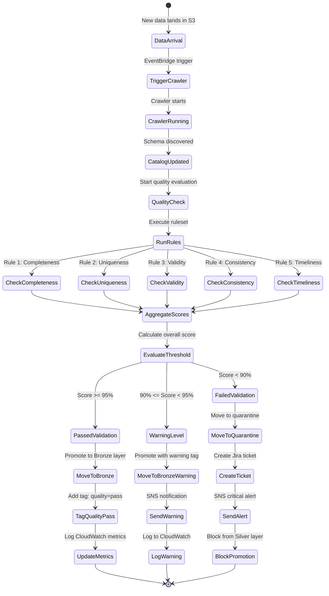
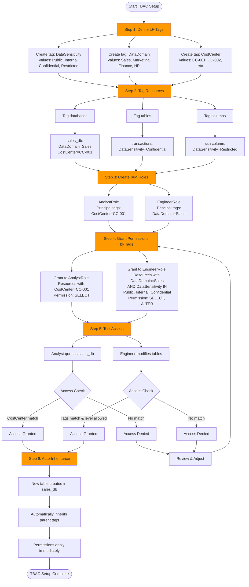
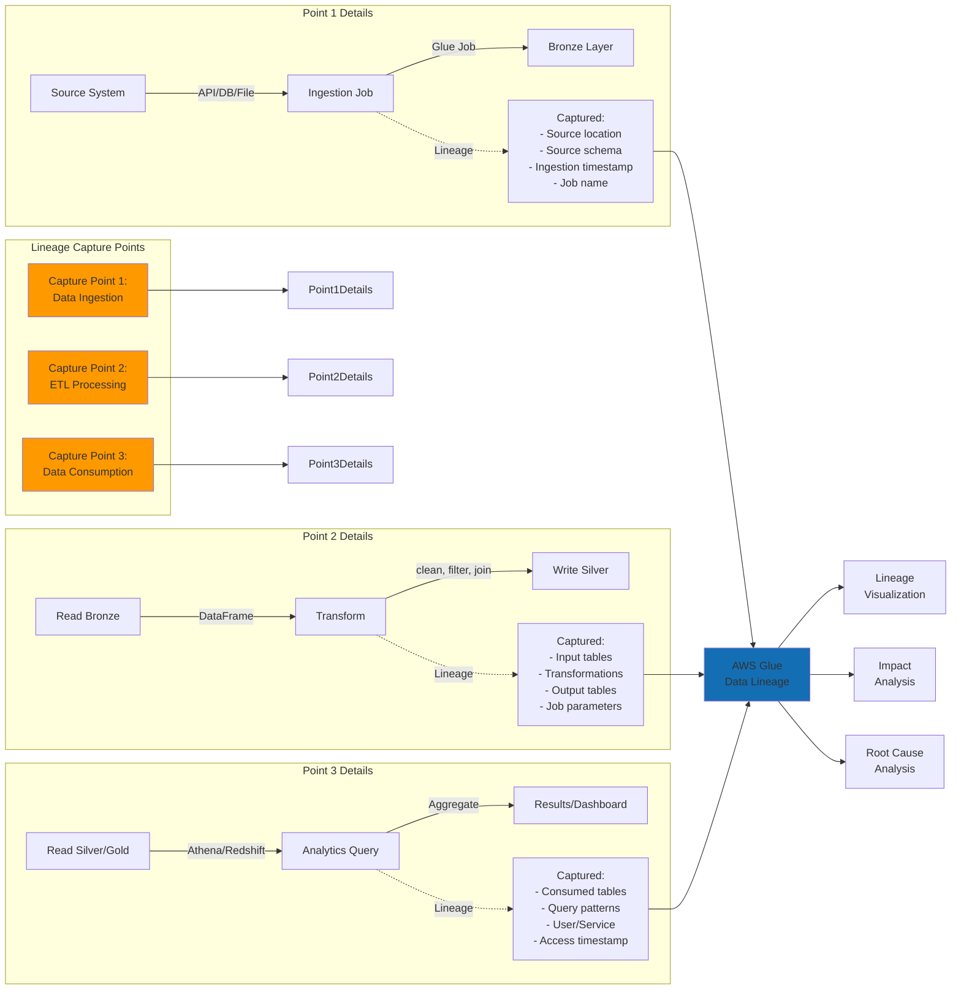
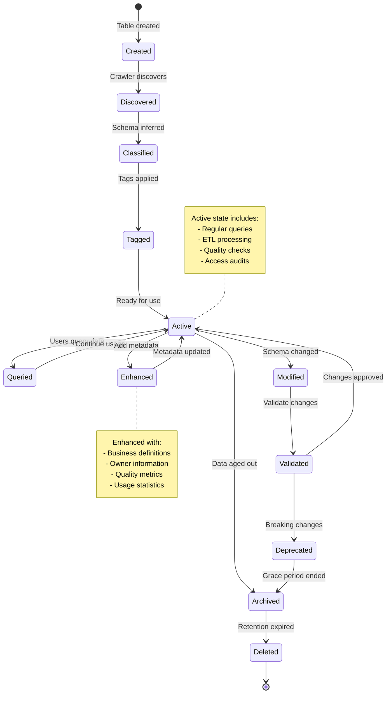
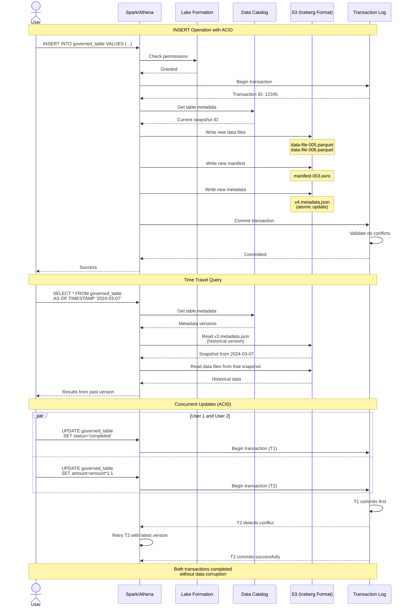
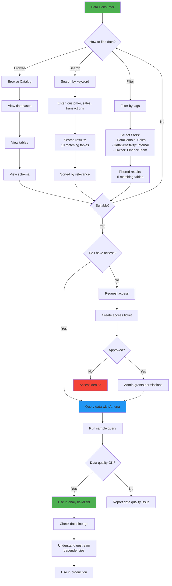
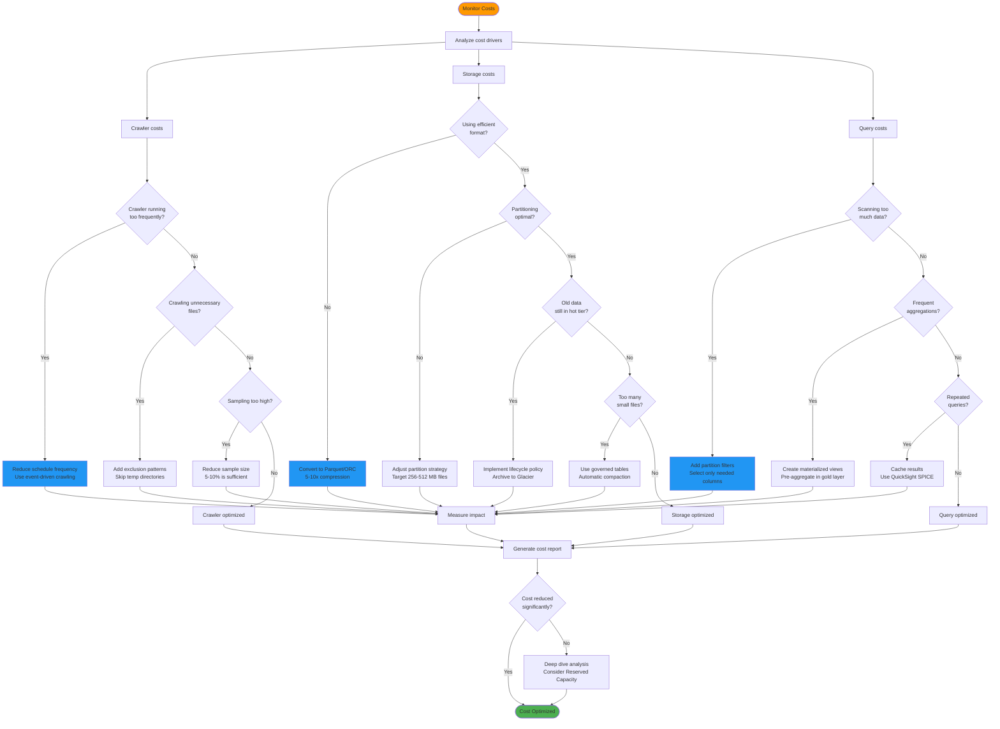

# Data Catalog & Governance Workflow Diagrams

## 1. Crawler Scheduling Patterns

## 2. Permission Grant Workflow

## 3. Data Quality Validation Flow

## 4. Tag-Based Access Control Setup

## 5. Data Lineage Capture

## 6. Cross-Account Sharing Workflow

```mermaid
flowchart TD
    Start([Producer wants to share data])

    Start --> Check1{Is Lake Formation<br/>enabled?}
    Check1 -->|No| EnableLF[Enable Lake Formation<br/>in both accounts]
    Check1 -->|Yes| Check2
    EnableLF --> Check2

    Check2{Are S3 locations<br/>registered?}
    Check2 -->|No| RegisterS3[Register S3 locations<br/>with Lake Formation]
    Check2 -->|Yes| CreateCatalog
    RegisterS3 --> CreateCatalog

    CreateCatalog[Create database & tables<br/>in Data Catalog]
    CreateCatalog --> VerifySchema{Schema correct?}
    VerifySchema -->|No| FixSchema[Run crawler or<br/>update schema manually]
    VerifySchema -->|Yes| GrantCrossAccount
    FixSchema --> GrantCrossAccount

    GrantCrossAccount[Grant permissions to<br/>consumer account]
    GrantCrossAccount --> SelectGrant{What to grant?}

    SelectGrant -->|Full database| GrantDB[Grant database:<br/>SELECT, DESCRIBE]
    SelectGrant -->|Specific tables| GrantTable[Grant table:<br/>SELECT, DESCRIBE]
    SelectGrant -->|Filtered data| GrantFilter[Grant table + data filter:<br/>Row-level security]

    GrantDB --> SetGrantOption
    GrantTable --> SetGrantOption
    GrantFilter --> SetGrantOption

    SetGrantOption{Allow consumer<br/>to re-grant?}
    SetGrantOption -->|Yes| EnableGrantOption[Enable grant option]
    SetGrantOption -->|No| DisableGrantOption[Disable grant option]

    EnableGrantOption --> NotifyConsumer
    DisableGrantOption --> NotifyConsumer

    NotifyConsumer[Notify consumer account<br/>via AWS RAM]

    NotifyConsumer --> ConsumerSide[Consumer Account Actions]

    ConsumerSide --> AcceptShare[Accept resource share<br/>in AWS RAM]
    AcceptShare --> CreateResourceLink[Create resource link<br/>in consumer's catalog]
    CreateResourceLink --> GrantLocal[Grant permissions to<br/>local IAM roles/users]
    GrantLocal --> TestQuery[Test query with Athena]

    TestQuery --> CheckResults{Query successful?}
    CheckResults -->|Yes| Success([Sharing Complete])
    CheckResults -->|No| Debug[Debug:<br/>Check permissions,<br/>KMS keys, bucket policy]
    Debug --> TestQuery

    Success --> Monitor[Monitor:<br/>- Access patterns<br/>- Query costs<br/>- Data freshness]

    style Start fill:#4CAF50
    style Success fill:#4CAF50
    style Debug fill:#F57C00
```

## 7. Metadata Management Lifecycle

## 8. Governed Table Operations

## 9. Data Discovery Flow

## 10. Cost Optimization Workflow

## Usage

These workflow diagrams provide step-by-step guidance for common Data Catalog and Governance operations:

1. **Crawler Scheduling**: Compare different trigger patterns
2. **Permission Grant**: Understand the permission granting sequence
3. **Quality Validation**: Automated data quality workflow
4. **TBAC Setup**: Implement tag-based access control
5. **Lineage Capture**: Where and how lineage is captured
6. **Cross-Account Sharing**: Complete sharing workflow
7. **Metadata Lifecycle**: How metadata evolves over time
8. **Governed Tables**: ACID transactions and time travel
9. **Data Discovery**: How users find and access data
10. **Cost Optimization**: Systematic cost reduction approach
