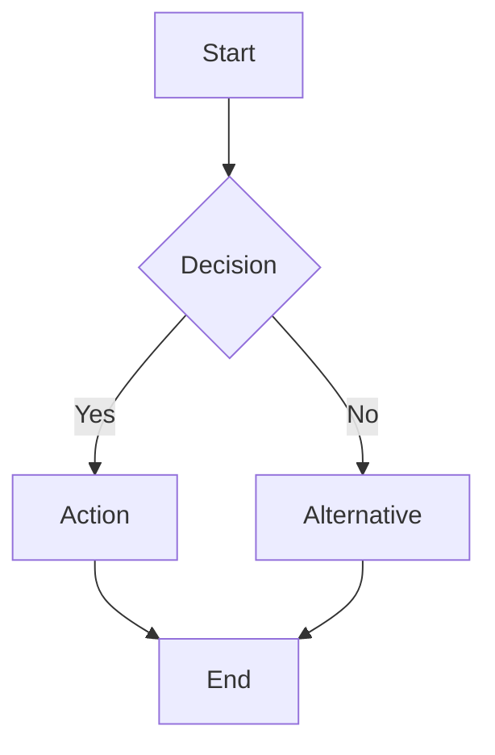
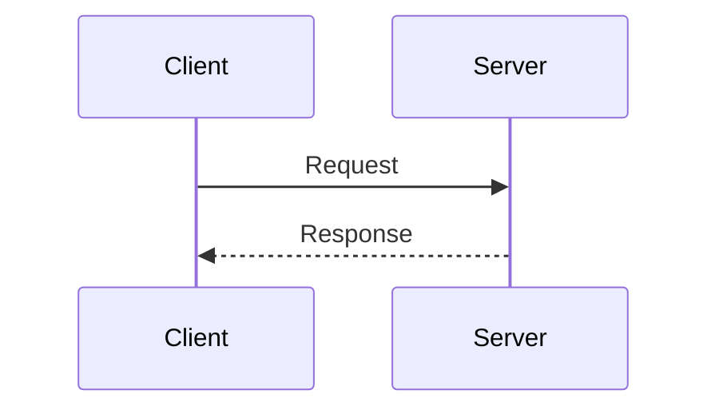
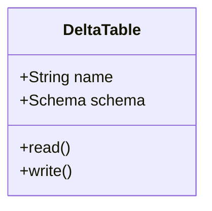

# Databricks Lakehouse - Architecture Diagrams

This directory contains Mermaid diagrams illustrating key concepts and architectures in the Databricks Lakehouse platform.

## 📊 Available Diagrams

### 1. [Databricks Platform Architecture](databricks-architecture.mmd)
**Purpose**: Overall platform architecture showing Control Plane, Data Plane, and cloud storage integration.

**Key Concepts**:
- Control Plane (Databricks-managed services)
- Data Plane (customer cloud account)
- Integration with AWS/Azure/GCP
- Security boundaries

**Learn More**: [theory/concepts.md](../theory/concepts.md#databricks-platform-architecture)

---

### 2. [Delta Lake Internals](delta-lake-internals.mmd)
**Purpose**: Deep dive into Delta Lake's transaction log and file structure.

**Key Concepts**:
- Transaction log (`_delta_log/`)
- Parquet data files
- ACID transaction flow
- Time travel mechanics
- Checkpointing

**Learn More**: [theory/concepts.md](../theory/concepts.md#delta-lake-fundamentals), [Notebook 01](../notebooks/01-delta-lake-basics.py)

---

### 3. [Unity Catalog Namespace](unity-catalog-namespace.mmd)
**Purpose**: Three-level namespace hierarchy and permission inheritance.

**Key Concepts**:
- Metastore (root)
- Catalog → Schema → Table hierarchy
- Permission inheritance
- Environment isolation (dev/staging/prod)

**Learn More**: [theory/concepts.md](../theory/concepts.md#unity-catalog), [Notebook 03](../notebooks/03-unity-catalog.py)

---

### 4. [Medallion Architecture](medallion-architecture.mmd)
**Purpose**: Bronze → Silver → Gold data processing layers.

**Key Concepts**:
- Bronze: Raw data ingestion
- Silver: Cleaned and validated
- Gold: Business aggregations
- Data quality checks
- Incremental processing

**Learn More**: [theory/concepts.md](../theory/concepts.md#medallion-architecture), [Notebook 02](../notebooks/02-etl-pipeline.py)

---

### 5. [Databricks vs AWS Native](databricks-vs-aws.mmd)
**Purpose**: Feature comparison between Databricks and AWS native services.

**Key Concepts**:
- Compute: Databricks Clusters vs EMR/Glue
- Storage: Delta Lake vs Parquet/Iceberg
- Data Warehouse: Databricks SQL vs Redshift/Athena
- Orchestration: Workflows vs Step Functions/MWAA
- Governance: Unity Catalog vs Lake Formation
- ML: MLflow vs SageMaker

**Learn More**: [README.md](../README.md#comparison-databricks-vs-aws-native)

---

### 6. [MLflow Workflow](mlflow-workflow.mmd)
**Purpose**: End-to-end machine learning workflow with MLflow.

**Key Concepts**:
- Experiment tracking
- Model training and tuning
- Model registry (Staging/Production)
- Model deployment (batch/real-time)
- Monitoring and retraining

**Learn More**: [Notebook 06](../notebooks/06-ml-with-mlflow.py)

---

## 🎨 How to View Diagrams

### 1. **VS Code** (Recommended)
Install Mermaid extension:
```bash
code --install-extension bierner.markdown-mermaid
```

Then open any `.mmd` file or this README.

### 2. **Mermaid Live Editor**
1. Copy diagram code
2. Open: https://mermaid.live
3. Paste and preview

### 3. **GitHub/GitLab**
Diagrams render automatically in Markdown files on GitHub/GitLab.

### 4. **Documentation Tools**
- MkDocs: Use `mkdocs-mermaid2-plugin`
- Docusaurus: Native Mermaid support
- Sphinx: Use `sphinxcontrib-mermaid`

---

## 🔍 Diagram Usage in Exercises

| Exercise | Relevant Diagrams |
|----------|-------------------|
| **Exercise 01**: Delta Lake | `delta-lake-internals.mmd`, `medallion-architecture.mmd` |
| **Exercise 02**: ETL Pipeline | `medallion-architecture.mmd`, `databricks-architecture.mmd` |
| **Exercise 03**: Unity Catalog | `unity-catalog-namespace.mmd` |
| **Exercise 04**: Streaming | `medallion-architecture.mmd`, `databricks-architecture.mmd` |
| **Exercise 05**: SQL Analytics | `databricks-architecture.mmd` |
| **Exercise 06**: ML with MLflow | `mlflow-workflow.mmd`, `databricks-architecture.mmd` |

---

## 📝 Diagram Syntax Reference

All diagrams use [Mermaid](https://mermaid.js.org/) syntax:

### Common Mermaid Elements

**Flowchart**:


**Sequence Diagram**:


**Class Diagram**:


---

## 🛠️ Customization

To modify diagrams:

1. **Edit `.mmd` files** with any text editor
2. **Preview changes** in VS Code or Mermaid Live
3. **Update documentation** if concepts change
4. **Regenerate images** (optional) with `mmdc` CLI:
   ```bash
   npm install -g @mermaid-js/mermaid-cli
   mmdc -i diagram.mmd -o diagram.png
   ```

---

## 📚 Additional Resources

- **Mermaid Documentation**: https://mermaid.js.org/
- **Databricks Architecture Docs**: https://docs.databricks.com/architecture/index.html
- **Delta Lake Internals**: https://delta.io/
- **Unity Catalog Docs**: https://docs.databricks.com/data-governance/unity-catalog/index.html

---

## ✅ Completion Checklist

Use this checklist to ensure you understand each diagram:

- [ ] Can explain Databricks Control Plane vs Data Plane
- [ ] Understand Delta Lake transaction log structure
- [ ] Can navigate Unity Catalog three-level namespace
- [ ] Explain Bronze/Silver/Gold layer purposes
- [ ] Compare Databricks vs AWS native for specific use cases
- [ ] Describe MLflow model lifecycle stages

---

**Need help?** Review the corresponding theory files and notebooks linked above, or refer to the [official Databricks documentation](https://docs.databricks.com/).
