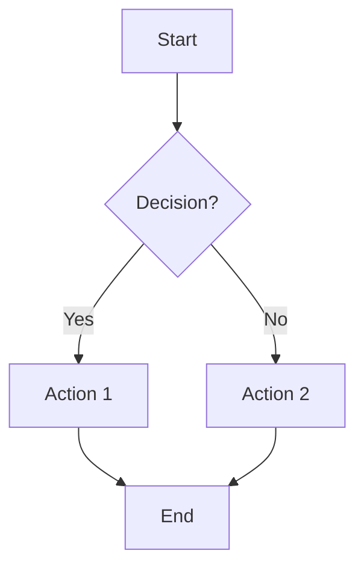
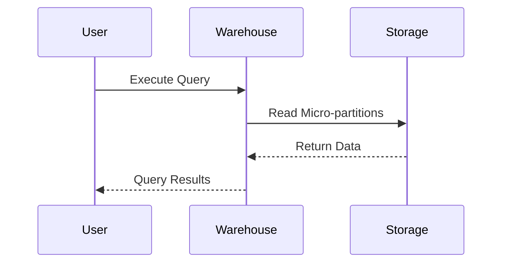
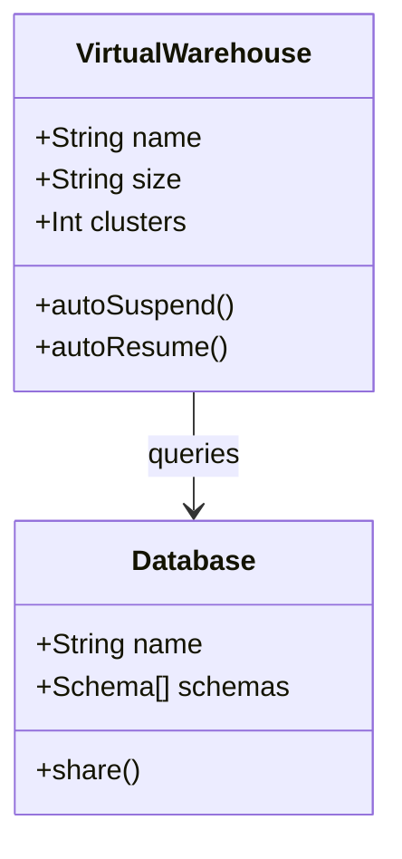
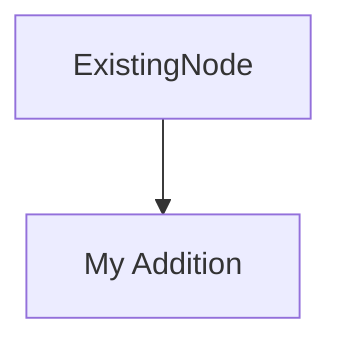

# Snowflake Data Cloud Diagrams

This directory contains comprehensive Mermaid diagrams illustrating key architectural concepts, patterns, and workflows in Snowflake Data Cloud.

## 📊 Available Diagrams

### 1. Snowflake Architecture (`snowflake-architecture.mmd`)
**Description**: Complete overview of Snowflake's three-layer architecture showing the separation of storage, compute, and cloud services layers.

**Learning Objectives**:
- Understand how micro-partitions organize data in the storage layer
- Learn about virtual warehouse compute isolation
- Explore cloud services components (optimizer, security, metadata)
- Grasp the benefits of separated storage and compute

**Use Cases**: System design, architecture discussions, platform overview

---

### 2. Virtual Warehouse Scaling (`virtual-warehouse-scaling.mmd`)
**Description**: Interactive decision tree and comparison showing when to scale up (larger warehouse) vs. scale out (multi-cluster).

**Learning Objectives**:
- Differentiate between vertical and horizontal scaling
- Understand credit consumption patterns
- Learn auto-scaling modes (Economy, Standard, Maximized)
- Apply cost-optimization strategies

**Use Cases**: Performance tuning, cost management, workload planning

---

### 3. Zero-Copy Cloning (`zero-copy-cloning.mmd`)
**Description**: Visual explanation of how Snowflake's instant cloning works using metadata pointers and copy-on-write.

**Learning Objectives**:
- Understand micro-partition metadata management
- Learn storage cost implications over time
- Apply cloning for dev/test/backup scenarios
- Optimize clone lifecycle management

**Use Cases**: Development environments, data testing, backup strategies

---

### 4. Time Travel & Fail-Safe (`time-travel-failsafe.mmd`)
**Description**: Timeline diagram showing Standard vs. Enterprise retention periods, query windows, and disaster recovery mechanisms.

**Learning Objectives**:
- Navigate time travel query syntax (AT, BEFORE)
- Configure retention periods per table
- Understand fail-safe vs. time travel differences
- Calculate storage costs for historical data

**Use Cases**: Data recovery, compliance audits, error correction

---

### 5. Streams & Tasks Pipeline (`streams-tasks-pipeline.mmd`)
**Description**: End-to-end CDC (Change Data Capture) pipeline using streams for incremental processing and tasks for orchestration.

**Learning Objectives**:
- Design incremental data pipelines with streams
- Schedule and chain tasks using DAG dependencies
- Monitor stream offsets and task execution
- Implement bronze → silver → gold architecture

**Use Cases**: ETL automation, real-time data processing, medallion architecture

---

### 6. Data Sharing Model (`data-sharing-model.mmd`)
**Description**: Provider-consumer architecture showing secure data sharing without data movement or duplication.

**Learning Objectives**:
- Create and manage shares with granular permissions
- Implement row-level security with secure views
- Understand cost allocation (provider storage, consumer compute)
- Explore data marketplace and monetization patterns

**Use Cases**: Multi-tenant SaaS, B2B data exchange, data products

---

## 🖥️ Viewing Instructions

### Option 1: VS Code with Mermaid Extension (Recommended)
1. Install the Mermaid extension:
   ```bash
   code --install-extension bierner.markdown-mermaid
   ```
2. Open any `.mmd` file
3. Right-click → "Open Preview"
4. View interactive, navigable diagram

### Option 2: Mermaid Live Editor
1. Visit https://mermaid.live/
2. Copy the contents of any `.mmd` file
3. Paste into the editor
4. Export as PNG/SVG if needed

### Option 3: GitHub Auto-Render
- Push files to GitHub
- View `.mmd` files directly in the browser
- GitHub automatically renders Mermaid diagrams

### Option 4: Command-Line Rendering (Advanced)
```bash
# Install Mermaid CLI
npm install -g @mermaid-js/mermaid-cli

# Render to PNG
mmdc -i snowflake-architecture.mmd -o snowflake-architecture.png -t dark -b transparent

# Render to SVG
mmdc -i virtual-warehouse-scaling.mmd -o virtual-warehouse-scaling.svg
```

---

## 🎯 Exercise-to-Diagram Mapping

| Exercise | Related Diagrams | Purpose |
|----------|------------------|---------|
| **Exercise 01: Architecture Setup** | `snowflake-architecture.mmd` | Understand layers before creating warehouses |
| **Exercise 02: Virtual Warehouses** | `virtual-warehouse-scaling.mmd` | Learn scaling decisions and cost implications |
| **Exercise 03: Data Loading** | `snowflake-architecture.mmd` | See how data flows through storage layer |
| **Exercise 04: Zero-Copy Cloning** | `zero-copy-cloning.mmd` | Visualize clone mechanism and cost tracking |
| **Exercise 05: Time Travel** | `time-travel-failsafe.mmd` | Navigate time travel syntax and windows |
| **Exercise 06: Streams & Tasks** | `streams-tasks-pipeline.mmd` | Design CDC pipelines with task DAGs |
| **Exercise 07: Data Sharing** | `data-sharing-model.mmd` | Implement provider-consumer architecture |

---

## 📝 Mermaid Syntax Reference

### Basic Flowchart Example


### Sequence Diagram Example


### Class Diagram Example


### Common Mermaid Shapes
- `[Rectangle]` - Default node
- `(Rounded)` - Rounded rectangle
- `{Diamond}` - Decision point
- `[(Database)]` - Cylindrical shape
- `[[Subroutine]]` - Double border
- `>Flag]` - Asymmetric shape

---

## 🎨 Customization Guide

### Editing Diagrams
All `.mmd` files are plain text and can be edited with any text editor:

```bash
# Open in VS Code
code snowflake-architecture.mmd

# Or use vim/nano
vim virtual-warehouse-scaling.mmd
```

### Color Schemes
Diagrams use consistent color coding:
- **Blue (#4A90E2)**: Storage layer, data objects
- **Orange (#F5A623)**: Compute layer, processing
- **Green (#7ED321)**: Cloud services, metadata
- **Pink (#BD10E0)**: External integrations, sharing
- **Yellow (#F8E71C)**: Warnings, costs

### Adding Custom Sections
You can extend any diagram by adding new sections:



### Regenerating with mmdc CLI
For automated rendering in CI/CD:

```bash
#!/bin/bash
# render-all-diagrams.sh

for diagram in *.mmd; do
    basename="${diagram%.mmd}"
    mmdc -i "$diagram" -o "${basename}.png" -t dark -b transparent
    mmdc -i "$diagram" -o "${basename}.svg"
done
```

---

## ✅ Completion Checklist

Use this checklist to track your understanding of each diagram:

- [ ] **Architecture**: Can explain the three-layer separation and its benefits
- [ ] **Scaling**: Can decide when to scale up vs. scale out based on metrics
- [ ] **Cloning**: Can calculate storage costs for clones over time
- [ ] **Time Travel**: Can write queries to access historical data
- [ ] **Streams & Tasks**: Can design an incremental CDC pipeline
- [ ] **Data Sharing**: Can create and consume shares securely

---

## 🔗 Additional Resources

### Official Snowflake Documentation
- [Architecture Overview](https://docs.snowflake.com/en/user-guide/intro-key-concepts.html)
- [Virtual Warehouse Guide](https://docs.snowflake.com/en/user-guide/warehouses.html)
- [Time Travel & Fail-Safe](https://docs.snowflake.com/en/user-guide/data-time-travel.html)
- [Streams & Tasks](https://docs.snowflake.com/en/user-guide/streams-intro.html)
- [Secure Data Sharing](https://docs.snowflake.com/en/user-guide/data-sharing-intro.html)

### Mermaid Documentation
- [Official Mermaid Docs](https://mermaid.js.org/)
- [Flowchart Syntax](https://mermaid.js.org/syntax/flowchart.html)
- [Sequence Diagrams](https://mermaid.js.org/syntax/sequenceDiagram.html)
- [Class Diagrams](https://mermaid.js.org/syntax/classDiagram.html)

### Learning Paths
- Review the main [module README](../../README.md) for context
- Work through exercises in order, referring to diagrams as needed
- Use diagrams during team discussions and presentations
- Customize diagrams for your specific use cases

---

## 📚 Diagram Maintenance

**Last Updated**: March 2026
**Snowflake Version**: Current with Q1 2026 features
**Maintainer**: Training Cloud Data Team

### Version History
- **v1.0** (March 2026): Initial diagram set created
- Future updates will track Snowflake feature releases

### Contributing
To suggest improvements:
1. Fork the repository
2. Edit `.mmd` files with proposed changes
3. Test rendering in Mermaid Live Editor
4. Submit pull request with description

---

## 💡 Pro Tips

1. **Start with Architecture**: Always review `snowflake-architecture.mmd` first to understand the foundation
2. **Print and Annotate**: Export diagrams as PDFs and annotate during learning
3. **Pair with Exercises**: Open diagrams side-by-side with exercise instructions
4. **Create Your Own**: After completing exercises, try creating diagrams for your real-world scenarios
5. **Share with Teams**: Use these diagrams in presentations and documentation

---

**Ready to dive in?** Start with `snowflake-architecture.mmd` to build your mental model of Snowflake's platform! 🚀
